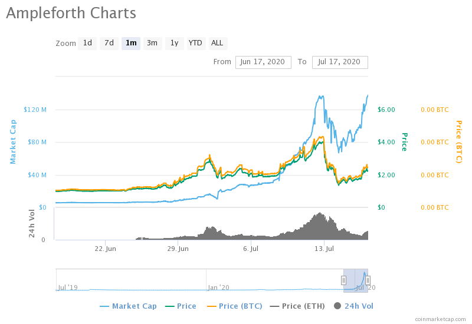

Title: Ampleforth
Slug: ampl-intro
Date: 2020-07-17
Tags: crypto, $AMPL
Summary: Introduction to Ampleforth

In the paper <a href="https://www.sciencedirect.com/science/article/pii/S1572308914000722" target="_blank">Synthetic Commodity Money</a>, George Selgin describes Bitcoin and other cryptocurrencies as synthetic commodities that address shortcomings traditional stores of value have. 
Specifically fiat money has mismanagement issues (queue present day Federal Reserve money printer) and commodities have unexpected supply shocks. The issue with Bitcoin is that there is a fixed amount, so deflation is built in. 
Another cryptocurrency with more elastic supply would have the benefits Bitcoin has as well as fix the deflationary issue. <a href="https://www.ampleforth.org" target="_blank">Ampleforth</a> tries to tackle this exact issue.

Ampleforth, \$AMPL, is one of the most interesting coins, because the supply of it changes daily based on the price. When the price is high, the wallet balances increases and when it is low the balance decreases.
The main purpose of this rebase is to dampen the volatility of the price, giving it an intrinsic ability to be a stablecoin and price other assets off of Ampleforth. In essence, the larger the market cap, the more stable \$AMPL price will be. The whitepaper can be found 
<a href="https://drive.google.com/file/d/1I-NmSnQ6E7wY1nyouuf-GuDdJWNCnJWl/view" target="_blank">here</a>.

<h3>How the rebase works works</h3>
I will outline two specific scenarios. 

<ol>
  <li>Jordan buys 1 Ample for $1 and the price soon increases to $2. The price-supply equilibrium would 'split' the Amples and Jordan would end up with 2 Amples worth $1 each. The total net worth of Amples is constant, this is literally a stock split.</li>
  <li>Say after this Jordan's Amples shoot down to $.5. Similarly, after the rebase period, he will end up with 1 Ample worth $1. This is akin to a reverse stock split</li>
</ol>

The exact details are subject to change but currently if the price is above a target threshold the supply expands and if it is below the supply contracts. Specifically the current price target is one 
<a href="https://www.bea.gov/data/personal-consumption-expenditures-price-index" target="_blank">2019</a> US dollar and price threshold is at 5%.
The rebalance occurs gradually over 10 days to smooth out the supply changes, but the key here is that this process is memoryless. The previous days supply change does not matter when calculating the current days supply change. Whatever the supply should be is just adjusted by $\frac{1}{10}$ everyday.
More details can be found in this <a href="https://medium.com/ampleforth/the-ampleforth-chainlink-oracle-integration-is-going-live-16053ccdebd5" target="_blank">article</a> written by the founder.

<h3>Trading Implications</h3>

This rebalance feature has massive implications for the trading world. It can be very harmful to leave stale bids as they can easily get swept from traders gaming the rebase period which occurs daily at 02:00 UTC. Also it should be possible to predict the rebase direction and benefit from front-running this equilibrium point.

<h3>Investing Implications</h3>

Unlike most crypto coins, the price of \$AMPL is really secondary to the market cap due to the rebase protocol. Below is a market cap and price over the past month from <a href="https://coinmarketcap.com/currencies/ampleforth/" target="_blank">coinmarketcap</a>.
We can see that while the price increased from $1 to around $2.3, around a 1.3x increase. However the market cap during this same period increased from 6 million to 120 million, a 20x increase and the true value of the investment during this period. 

<h3>Additional Thoughts</h3>

Due to the rebase mechanism, \$AMPL should have very unique returns characteristics, uncorrelated with other assets both in the traditional space and the crypto space. 
I believe that it is the ultimate momentum asset because as long as the price stays above $1 the supply will increase. People will see that their net worth has gone up and buy more \$AMPL.
Thoertically people will sell the extra \$AMPL for every new issuance, but I do not think that will happen. People will chase returns and put even more money into \$AMPL to recieve a larger split.
In a market prone to rapid bull runs, it is against human nature to sell. They will infact buy more \$AMPL, leading to an increase in \$AMPL supply and potentially causing a large feedback loop.
I am not advocating for the fundamentals of \$AMPL, rather I believe that the built in mechanics give it a shot to multiply a lot more than some of the other smallcap crypto coins.
I believe return distribution should have a lot higher right skew and kurtosis than a normal smallcap.

