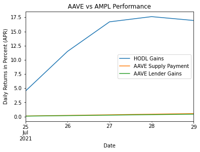

Title: Ampleforth on AAVE
Slug: ampl-lending
Date: 2021-07-29
Tags: crypto, $AMPL
Summary: Ampleforth lending on AAVE is unique due to the rebase mechanisms.

<h3>Background</h3>
Over a year ago, I wrote an [article](./ampl-intro.html) describing the properties of $AMPL. 
To recap, $AMPL is a token which rebases to the <a href="https://www.bea.gov/data/personal-consumption-expenditures-price-index" target="_blank">2019</a> US dollar and price threshold is set to 5%.
This means if the price is greater than 1.05[ref]Everything is based on 2019 US dollars to remove inflation[/ref], the current price is corrected by 10% of the delta needed to hit the Target Price which is 1 and the supply is increased by that same amount.
The exact opposite happens if the price is less than .95 (2019 US dollars) there will be a price increase and a supply decrease of the same percentage.
If the price is outside the .95 to 1.05 price range, the daily rebase will occur at 2AM UTC.
For example, if the current $AMPL price is 1.1, there will be a 1% rebase and the new $AMPL price will be 1.09 with a supply increase of 1%.

<h3>$AMPL on AAVE</h3>

After a months long <a href="https://governance.aave.com/t/proposal-add-support-for-ampl/854" target="_blank">forum proposal</a> to add AMPL to AAVE as a borrowing currency. <a href="https://aave.github.io/aip/AIP-12/" target="_blank">AIP-12</a> was <a href="https://twitter.com/AmpleforthOrg/status/1419041391590592512" target="_blank">implemented</a>.
Due to the nature of AAVE debt tokens combined with the rebasing mechanism of $AMPL, positive rebases can create arbitrage opportunities for the borrowers at the expense of the lenders.
Suppose there was 1000 $AMPL in AAVE and Max borrowed all 1000.
If rebase is 5%, Max now has 1050 $AMPL in his inventory but only has to return 1000 (plus interest).
The issue is that the interest AAVE charges is less than the rebase return so Max gets risk free rebases as long as AMPL is above a dollar. 
When the rebases become negative, Max can simply return all the AMPL he borrowed and the lenders are on the hook for the negative rebases but do not profit as much for the positive rebases essentially giving Max a free call option.
This exact scenario was <a href="https://governance.aave.com/t/proposal-add-support-for-ampl/854/80" target="_blank">described</a> in the forums a <a href="https://governance.aave.com/t/proposal-add-support-for-ampl/854/87" target="_blank">few</a> times.
Fast forward to the launch and we see 100% utilization on the pool, because of this exact positive rebase scenario.

The AAVE interest rate <a href="https://docs.aave.com/risk/liquidity-risk/borrow-interest-rate#interest-rate-model" target="_blank">formula</a> (for borrowing) is below.
When the utilization is below a certain threshold the borrow rate increases slowly, but when utilization is above this number, there is a sharpe increase of borrow rate which we can see in the plot below which is capped at around 48%.
Currently the base rate is set to 0, the optimal utilization is 90%, slope 1 is 3% and slope 2 is 45% giving us a max APY of 48% and max APR of around 39% at 100% utilization.

\begin{align}
	&\begin{cases}
      R_t = R_0 + \frac{U_t}{U_{\text{optimal}}}R_{\text{slope1}} & \text{U < } U_{\text{optimal}}\\
      R_t = R_0 + R_{\text{slope1}} + \frac{U_t - U_{\text{optimal}}}{1 - U_{\text{optimal}}}R_{\text{slope2}} & \text{U} \geq U_{\text{optimal}}\\
    \end{cases}    \\
& \text{where}  \\
& U = \text{Utilization Rate} \\
& U_{\text{optimal}} = \text{Optimal Utilization Rate} \\
& R_t = \text{Interest Rate} \\
& R_0 = \text{Base Rate} \\
& R_1 = \text{Slope 1 Rate} \\
& R_2 = \text{Slope 2 Rate} \\
\end{align}

<h3>Rebase vs AAVE</h3>

Before we look at the rebase rates, is important to make the distinction between APY and APR.
APY is the continuously compounding annual rate while APR stands for annual percentage rate which does not compound.
AAVE reports yield in APY while AMPL rebase is in APR so it is a little hard to compare the two. 
For reference, the 48% max APY on AAVE (for $AMPL) translates to around a 39.2% APR.
When comparing the AAVE rates with the AMPL rates, we will be using APR.

Since $AMPL was introduced into AAVE on July 24th, there have been 5 rebases, 4 of which were positive while this most recent one was negative.
In that time, the <a href="https://www.coin-tools.com/ampl/ampl-rebase-history/" target="_blank">rebase gains </a> were about 16.94% APR while AAVE interest cost cumulatively 0.537% APR interest[ref]This is assuming 100% utilization, but the actual utilization during negative rebases is less than that[/ref].
In addition, the deposit APR received is even less than 0.17% APR as AAVE takes a 20% cut. 
Assuming a 100% borrow rate, and the fact that AAVE has no stable borrows, the deposit APR is 80% of the funding paid so it would be around 0.429% instead of 0.537%

Due to the large delta of the rates that a few foresaw, there is a a new <a href="https://governance.aave.com/t/arc-raise-ampl-maximum-interest-rate/4996" target="_blank">governance thread</a> to discuss potential solutions.
The first suggestion would be to change the parameters to the following:
<ul>
  <li>Optimal Utilization = 75%</li>
  <li>Slope1 = 2%</li>
  <li>Slope2 = 10,000%</li>
</ul>
The proposal turns borrowing above the utilization rate extremely aggressive and would be more than 200x increase in APY and 11.8x increase in APR over the current parameters at 100% utilization. 
We end with a max borrow APR of around 464% or 1.27% daily. 

What if we started with this new formula from the first rebase on July 25th? 
Assuming 100% utilization, we see that the borrowers paid around 6.36% interest while the lenders received around 5%, still less than 33% of what they would get from holding.
While this proposal is a step in the right direction, the overarching problem is that the suppliers of $AMPL in AAVE will keep on under preforming in periods of high rebase.
It remains to be seen how much is borrowed during periods of negative rebase, but I doubt that it will be enough to cover the delta just in these past few days.

<h3>Conclusion</h3>

$AMPL lenders in AAVE are giving up a lot of the upside performance during periods of high rebase and should consistently under-preform a buy and hold approach.
Given that $AMPL cannot be used as collateral, I am not sure why anyone would put $AMPL in AAVE. 
Currently we are going to have another negative rebase and we can see that there currently is only 43% utilization rate, a number I expect to rapidly drop as we approach the 2AM UTC rebase.

Given that we can only tweak interest rate, base rate, slope rate 1, and slope rate 2, I am not sure there are many alternatives other than making the parameters ramp up more.
Some other suggestions would be to drop the optimal utilization even further and increase slope 2 even more but honestly that is not going to change much.
The lenders need some way so that the borrows do not get a risk free look at the rebase. 
This is not possible in AAVE as it stands but adding some fixed term rate could be useful here.
So before people know if the rebase is positive or negative, sell locked AMPL rates for the next n days.

