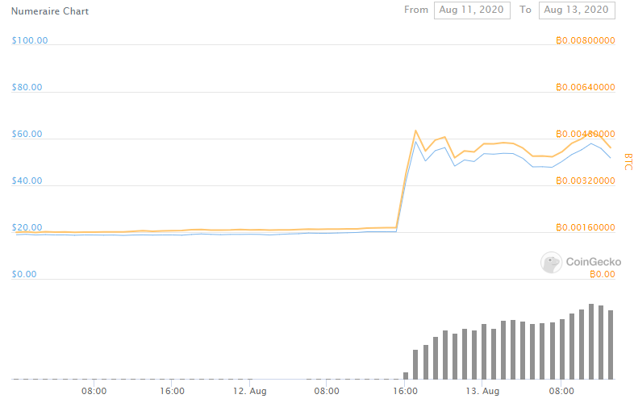

Title: The Exchange Pump: Introduction (Part 1)
Slug: exchange-pump-1
Date: 2020-08-13
Tags: crypto, exchange, Defi
Summary: The impact of top tier exchanges listing new coins

<h3>Tier 1 Crypto Exchanges</h3>

When a coin lists on tier 1 exchanges, the coin often receives a price increase.
A tier 1 exchange can loosely be defined as an exchange that is secure, has good liquidity, and is trusted by the community. Two of the most popular coin price aggregator sites 
<a href="https://www.coingecko.com/en/exchanges" target="_blank">Coingecko</a> and 
<a href="https://coinmarketcap.com/rankings/exchanges/" target="_blank">CoinMarketCap</a> have their respective exchange rankings, and most people agree on some order of Binance, Coinbase, Huobi, Bitstamp, and Kraken.
Of these tier 1 exchanges, Binance and Coinbase have the most new coin offerings.

<h3>Listing Theory</h3>

I am not sure why the coins listed on these exchanges receive this immediate price increase, but my two working hypothesis are:

<ul>
  <li>These exchanges are deemed trustworthy so the coins they list are likewise given a trustworthy stamp of approval, which increases the value of the coin.</li>
  <li>Some market participants may only have accounts on these top exchanges and thus were unable to purchase these coins before when they were available for presale or on smaller exchanges. 
  These top exchanges are very popular fiat on-ramps[ref]They have good relationships with regulators and banks of various countries in addition to strong marketing teams.[/ref] and a lot of more novice users can deposit their respective home country currencies and buy crypto.
  So when a tier 1 exchange lists, there are more participants[ref]It can also be argued that these new participants are less crypto savvy and filled with more 'retail' traders.[/ref] similar to an IPO.</li>
</ul>

<h3>Numearie Example</h3>

Yesterday Coinbase announced the listing of Numearie, $NMR, through its twitter account and on its blog. 
Below is a picture of the $NMR price before and after the tweet.
We can see a rapid increase from $20 to around $60, before stabilizing at around $50, over a 100% increase just due to the Coinbase listing action. 

<h3>Historical Examples</h3>

Focusing on the Coinbase exchange which has some of the most retail flow, I will examine the performance of all of the newly listed coins[ref]I do not consider Bitcon Cash a new listing.[/ref]
before and after the Coinbase announcement.
Because the <a href="https://blog.coinbase.com/tagged/coinbase-pro" target="_blank">listing</a> announcements span both across bull and bear markets, it is more reasonable to look at performance in BTC terms as opposed to dollar terms.

<h3>Data</h3>

Data is pulled from the Coingecko <a href="https://www.coingecko.com/en/api" target="_blank">api</a>. Some coins like $OXT and $COMP are excluded, because Coingecko did not have sufficient clean data prior to announcement.
I also excluded stable coins like $DAI as they should be inherently pegged to the dollar and removed $NMR, because there is not enough data.
This leaves us with 22 new listings to examine.

Below we see a group of plots, where the x-axis time is in days and time=0 is the listing date, 1 is be the day after listing and -1 is be the day before listing.
The y-axis shows the cumulative return from time t=-2 to time t=2.
We can see that there are clear outliers like $LINK and $BAND which increased over 50% on listing day, but most of the time there is still a clear positive (albeit smaller) gain from listing.

I have included the mean and median of these cumulative returns and we can see that on average there is around a 15% increase from listing and the median listing increase is approximately 8%.

<h3>Next Steps</h3>

In the upcoming days, I will write two follow up articles about strategies that can be used in tandem to front-run these exchange listings. 
The [first](./exchange-pump-2.html) will be how to identify coins which have a high probability of listing and the [second](./exchange-pump-3.html) will be how to guesstimate when the coins will be listing.
