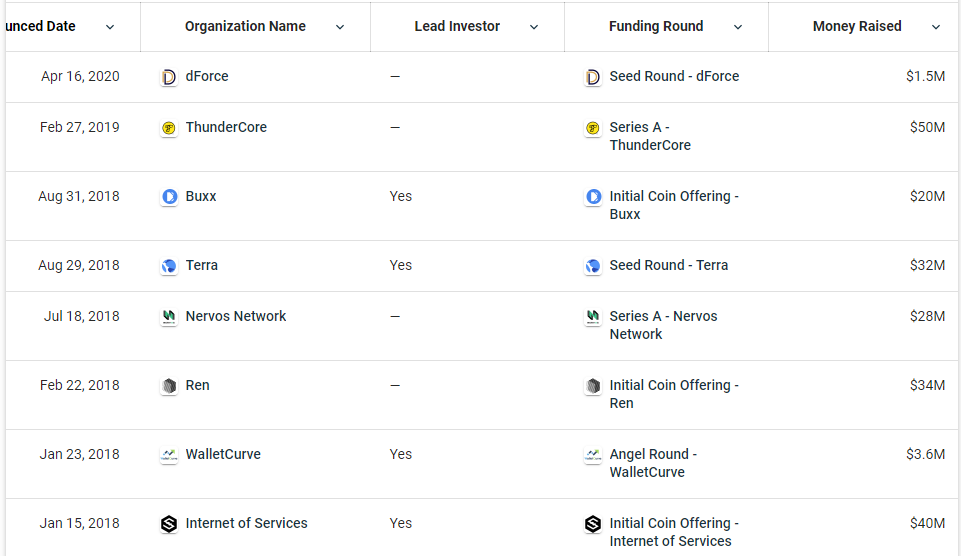
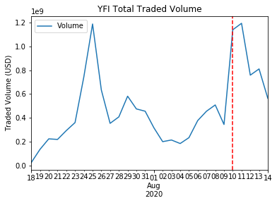

Title: The Exchange Pump: Aligned Incentives (Part 2)
Slug: exchange-pump-2
Date: 2020-08-14
Tags: crypto, exchange, trading
Summary: How to anticipate new coin listings on exchanges with educated guesses

<h3>Aligned Incentives</h3>

In the prior article, I explored the impact of a new listing on a tier one exchange and showed that listings are very beneficial to a coins price in the near term.
However there are thousands of coins, so its very difficult find which one will be listed and guessing specific coins is a low probability endeavor. 
In this article, I will show how it is possible to find coins with high probability of listing by looking at alternative data.

<h3>Exchange Investments</h3>

In traditional finance, the Volcker Rule was created to remove banks from investing as this was deemed a conflict of interest with the customers they served.
Thus many internal trading desks and investment arms of these banks were wound down and spun off. 
In the crypto world, these exchanges hold a vast amount of power as they act as a bank, an exchange, a broker, as well as a hedge fund.

In a clear conflict of interest, these top exchanges all have venture arms where they invest in coins and then are able to list the coins on to their own exchanges to give these coins a nice pump.
While this action is shady, it can be taken advantage of as I know that the exchanges are highly incentivized to list their own coins.
Thus, by examining the holdings of the venture portfolios of the top exchanges, I can narrow down the coins, and have a high conviction in the specific coins that will be listed.

<h3>Huobi Capital</h3>

Below is a picture of all of Huobi Capital's (the venture arm of Huobi exchange) <a href="https://www.crunchbase.com/organization/huobi-bd34/recent_investments" target="_blank">investments</a>. 
WalletCurve does not seem to have a coin and I cannot find any information on Buxx, however Huobi has listed the 5 of the other projects:
<ul>
  <li><a href="https://www.coingecko.com/en/coins/iost" target="_blank">Internet of Services, \$IOST</a></li>
   <li><a href="https://www.coingecko.com/en/coins/ren" target="_blank">Ren, \$REN</a></li>
  <li><a href="https://www.coingecko.com/en/coins/nervos-network" target="_blank">Nervos Network, \$CKB</a></li>
  <li><a href="https://www.coingecko.com/en/coins/terra-luna" target="_blank">Terra, \$LUNA</a></li>
  <li><a href="https://www.coingecko.com/en/coins/thundercore" target="_blank">ThunderCore, \$TT</a></li>
</ul>
The only one that Huobi has not listed is dForce, probably because it was a recent investment, but I have high conviction that it will be listed eventually.

<h3>Other Exchanges</h3>

Both of <a href="https://www.crunchbase.com/organization/binance-labs/recent_investments" target="_blank">Binance Labs</a> 
as well as <a href="https://www.crunchbase.com/organization/coinbase-ventures/recent_investments" target="_blank">Coinbase Ventures</a> 
have large portfolios that contain a variety of companies some of which have launched coins. There are a few that have not been listed and I expect them to be listed soon.
In no particular order they are \$UMA, \$RSR, \$MATIC, and \$LUNA. 

<h3>Popular Coins</h3>

Exchanges make money off trading volume. If a lot of people want to trade a token, it is in the exchanges best interest to list said token so they can collect trading fees.
Trading fees are inherently a zero sum game, because if I trade on a certain exchange, that exchange will get the trading fees and other exchanges wont. 
So when exchanges see large volume from a coin, they also rush to list said coin to get a piece of the pie.

$YFI launched on July 18th and has consistently had tremendous amounts of volume on decentralized exchanges[ref]These exchanges have no KYC and will list anything. A negative side-effect is that there are alot of scam tokens.[/ref] always ranking in the top 5 in volume traded.
Below are the exact volumes from launch date till today. The dash red line is August 10th, when Binance listed \$YFI. 

\$YFI averaged around 50 million dollars in daily volume primarily on decentralized platforms like Uniswap and Balancer. 
Looking at the volume charts, this made \$YFI a top 50 coin[ref]Stable coins are not counted in this volume assessment[/ref] based on volume traded.
Binance has listed almost all of the coins higher on the ranking and adding \$YFI was very low hanging fruit.
Fast forward to today and Binance has captured around 75% of the \%YFI volume.

<h3>Exchange Profits</h3>

Here is a quick calculation on how much Binance makes in profit off of trading fees. 
The numbers may be slightly off, but in the Binance whitepaper, 20% of all exchange profits go towards \$BNB token buybacks.
In the year end review <a href="https://www.binance.com/en/blog/418708327988203520/Binance-2019-Year-in-Review" target="_blank">blog</a> we can see that around \$207,338,000 worth of \$BNB was burned.
This means that the total profit of Binance was around 5 times that amount at over \$1,000,000,000.  
Looking at the average trading volume, we can see that there are \$2,852,591,354 dollars in trades per day. 
Multiplying by 365 gives us around 1 trillion dollars in traded volume.
Thus with a easy back of the hand estimate, we can see that Binance makes approximately 10 basis points per dollar traded, in line with their <a href="https://www.binance.com/en/fee/schedule" target="_blank">fee schedule</a>.
[ref]The calculations are slightly off as Binance does other things that are also profitable, but fees are the primary driver and this is just a ballpark number[/ref]

In the 4 days after listing, Binance traded around 37.5 million dollars per day of \$YFI. This equates to around 37.5k in profits for Binance. 
If those numbers stayed constant for the entire year, Binance would make around 3.5 million from the \$YFI listing. 
Listing a particular coin is very low hangning fruit as Binance has over a hundred different ones and optimized the procedure.
It is pretty clear why Binance and other exchanges are heavily incentized to list these high volume coins.

<h3>Conclusion</h3>

By looking at the revenue model of the exchanges, we can narrow down the list of new addition candidates substantially. 

