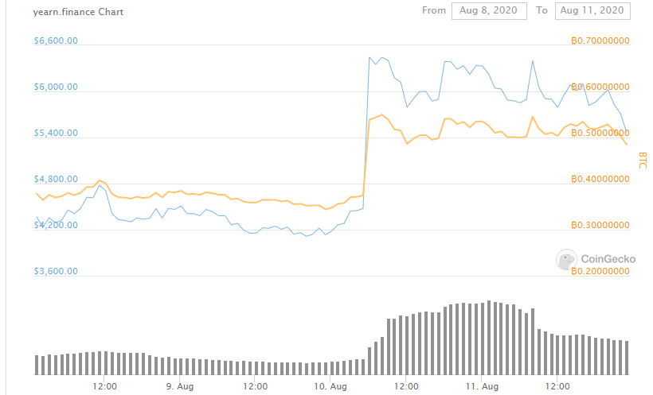

Title: The Exchange Pump: Coin Tracking (Part 3)
Slug: exchange-pump-3
Date: 2020-08-15
Tags: crypto, exchange, trading
Summary: How to anticipate new coin listings on exchanges by tracking exchange wallets

<h3>Recap</h3>
Previously I wrote two articles, [one](./exchange-pump-1.html) describing how listing on tier 1 exchanges is beneficial to price of coin, and the [other](./exchange-pump-2.html) detailing how to identify these potential listings.
This article focuses on trying to pinpoint when an exchange will list a particular coin.

<h3>Etherscan</h3>

<a href="https://etherscan.io" target="_blank">Etherscan</a> is a website which allows people to track transactions on the ethereum blockchain. 
Specifically, people can search specific transaction ids to see the wallet that sent the tokens, the wallet that received the tokens, how much tokens were sent, and when the transaction occurred.
Another tool on etherscan is the ability search by wallet id to see how much tokens are in a wallet and the historical transactions of all the tokens in said wallet. 

This is akin to a continuous time 13-F form that traditional finance uses. 
At the end of every quarter, funds with at least \$100 million assets under management must share their holdings.
Often times analysts study these hedge fund positions to try to capture some of that supposed alpha.
Due to the nature of the open blockchain, I am similarly able to query the current holdings all the players in the ecosystem.
However, this is even more powerful than a 13-F, because the blockchain allows me to see all the holdings live rather than the once per quarter snapshot.

<h3>Trade Theory</h3>

Delving one step deeper, if I know the exchange wallet ids, I can see all transactions and holdings of said exchange. 
This can be used to find new listings, because I can constantly scan an exchange wallet to look for coins deposited in the wallet that are not listed.
Prior to listing, an exchange would need to store some coins and test the deposit/withdraw mechanisms as well as trading logic dedicated to the new token listing for bugs.
So if I see a large increase of a unlisted coin in the wallet address of a large exchange, it is a very probable bet that the exchange will list the token soon.

<h3>Binance Example</h3>

A few days ago, on August 10th, Binance <a href="https://www.binance.com/en/support/articles/a2e3970cd7334b659d426e547f7bcea0" target="_blank">listed</a> $YFI[ref]This coin has very strong fundamentals and I am very bullish on it. Will make a seperate post on the fundamentals.[/ref] also known as yearn finance at around 09:28 UTC.
Just like the other Coinbase coins in my previous blog post, \$YFI immediately rallied after this announcement, going from \$4200 to \$6500, before settling down around \$6000. 

However, looking closely at the Binance wallet on Etherscan, the <a href="https://etherscan.io/tx/0xe9ce4900f4193db560f4c33701625552ec114ad514651b881422af66fbebb0ba" target="_blank">first </a> \$YFI transaction 
in Binance occurred  at 4:34 UTC, almost four hours before the official blog post and tweet.
In fact there were over 50 \$YFI transactions with the Binance wallet before the official announcement. 
If someone where to been tracking popular unlisted coins on the ethereum blockchain, they would have been able to frontrun Binance and the exchange listing. 
In fact there is a small run up in the price and volume of \$YFI before the accouncement and I believe some other savvy participants noticed these Binance transactions and started to buy \$YFI. 

<h3>Conclusion</h3>

I can use information from alternative data to search for which coins I believe will list and then if these coins are on the ethereum blockchain, I am able to predict when they will list.
I view these trades as asymmetric bets, because if the exchange does not list the token, I can get rid of the coin close to buy price.
On the off chance that the coin is listed, the returns are usually astronomical.
It would be interesting to get statistics on how often each exchange has transactions from non-listed coins and how often these become actual listings.

