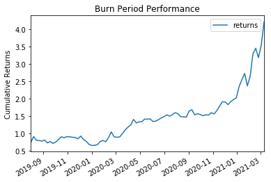

Title: FTT Mondays
Slug: ftt-2
Date: 2021-03-31
Tags: $FTT, altcoins
Summary: When is the best time to buy \$FTT?

<h3>Background</h3>
After reading the [previous](./ftt-1.html) article, the follow up question would be when to buy. 
Luckily, we can use the buyback mechanism as a good entry point barometer and also a stand alone trading strategy.
We know there is a buyback that starts after 10pm HKT each Monday and ends before 11:59pm HKT Tuesday. 
In these 26 hours, FTX buys back $FTT on the open market giving it synthetic buy pressure, so it is ideal to buy right before this period.

<h3>Basic Trading Strategy</h3>

The first buyback was on 08/01/2019 and there have been about 90 more since then[ref]This article uses data until mid March 2021.[/ref]. 
By creating a simple strategy that buys $FTT at the initial buyback period and sells as the period ends, we can see how much edge there is when executing before this period.
Below is the cumulative return of this period with an average of over 2% per day and a total of over 4x in around 85 days.

<h3>Trading Strategy Tweaks</h3>
<h5>Timing Improvement</h5>

There are ways to just make money trading this strategy, but adding a few more bells and whistles to make this strategy more lucrative.
One of these possible strategy enhancements is to stalk the network to see when the burn occurs and end the trade at that moment, reducing unnecessary delta exposure to the market[ref]One week in August 2020, burn occurred on 08/14/2020 instead of usual 08/11/2020.[/ref]..
We are able to track the buybacks by looking at large burn <a href="https://etherscan.io/tx/0xc780a0944f644454c6a07e08c4446e07f01ddfdc0190935a0234feaa3b12009b" target="_blank">transactions</a>.
So instead of closing the trade at 11:59pm HKT, we close whenever the burn concludes.

<h5>Buy Back Size</h5>

Buybacks can be tracked by the either on etherscan or also on the <a href="https://ftx.com/en/ftt" target="_blank">burn</a> page.
After normalizing (in USD) for the size of the burn, we can run correlations[ref]Spearman is used which better accounts for nonlinearity. I believe this would be more accurate here as there are often out-sized momentum moves.[/ref]
 to see that there is a strong positive relationship (.36) between the size of the burn and the resulting performance.
A trading strategy would be to size up when buy is large and size down when burn is small.
Breaking down the USD burn size into quantiles, the following strategy is run: if the burn size is in the upper 75% we 2x the size, bottom 25% half size, and we keep same size for middle two quantiles.

Below are risk adjusted stats of the baseline and the various strategy tweaks.
We see that the baseline is very strong with an average of 2.3% gain and high sharpe/sortino ratios. 
The pnl is skewed right as the average winner is higher than the average loser. All in all a very powerful trade.
Looking at our adjustments, we can see that conditioning trading size on burn size is positive expected value. 
We get an increase to 3.2% as well as boosts to sharpe and average winner goes up while average loser goes down.
However, the timing adjustment does not seem to help the strategy at all and decreases performance in both outright pnl and risk adjusted metrics.
Perhaps there is a momentum effect after this day and cutting off at the burn time does not properly capture the residual momentum.

|         | Baseline | Sizing | Timing |
|---------|---------:|-------:|-------:|
| Mean    |    0.023 |  0.032 |  0.019 |
| Sharpe  |    3.990 |  4.830 |  3.630 |
| Sortino |   15.330 | 12.920 | 11.660 |
| Win%    |    0.610 |  0.610 |  0.610 |
| u\_win  |    0.050 |  0.070 |  0.050 |
| u\_lose |   -0.030 | -0.020 | -0.030 |
| best    |    0.730 |  0.730 |  0.630 |
| worst   |   -0.100 | -0.190 | -0.090 |

<h3>Conclusion</h3>

A great time to buy $FTT is right before the buyback period (10pm HKT on Mondays).
The rest of the article examines a basic strategy based on market microstructure and shows the impact of simple tweaks on strategy performance.
There are out sized returns during this specific time period because of the mechanics of the $FTT coin.
Knowing specific details of how other coins behave can help uncover similar trades to this one.

An extension of this strat to get even more risk neutral would be to short other centralized exchange coins like $BNB, $HT, $LEO, and $KCS in which case it is a pure play on this buyback.

