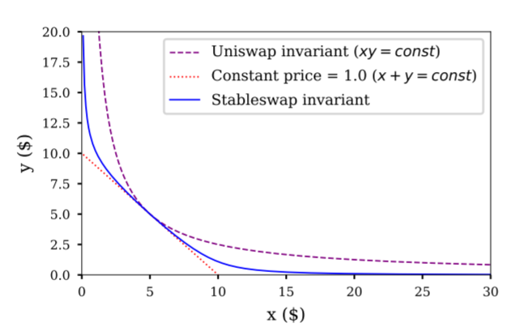

Title: The Slowest Oracle Attack
Slug: integral
Date: 2021-06-09
Tags: crypto, $ITGR
Summary: A bad oracle causes stablecoin loss.

<h3>Background on Oracle Attacks</h3>

Some of the <a href="https://www.rekt.news/leaderboard/" target="_blank">largest hacks</a> in the DeFi space are due to oracle attacks, which is when price feeds are manipulated (typically via flash loans) allowing for arbitrage opportunities. 
Popular examples of these attacks include <a href="https://www.rekt.news/pancakebunny-rekt/" target="_blank">Pancake Bunny</a>, <a href="https://www.rekt.news/yearn-rekt/" target="_blank">Yearn</a>, and <a href="https://www.rekt.news/harvest-finance-rekt/" target="_blank">Harvest Finance</a>.
Below is a snippet from the Harvest page linked above which shows how the attack worked:
<ol>
  <li>Swap 11.4m USDC to USDT -> USDT price up</li>
  <li>Deposit 60.6m USDT into Vault</li>
  <li>Exchange 11.4m USDT to USDC -> USDT price down</li>
  <li>Withdraw 61.1m USDT from Vault -> 0.5m profit</li>
</ol>
The attacker was able to withdraw more USDT at step 4 because of the changed USDT price. As the price of USDT was lower during the time of the withdrawal, their shares represent more USDT from the Vault pool.
This translated to around a 24 million dollar windfall at the expense of the Harvest vaults.

This article will describe in depth a slower oracle attack that occurred over a few days with a new AMM called Integral: the steps to create the opportunity and what the Integral team did to prevent the attacks.
The whistles and bells of each oracle attack are unique, but the premise is the same: have a deep understanding of the oracle(s) to manipulate the price feeds and arbitrage the underlying.

<h3>Integral</h3>

<a href="https://docs.integral.link" target="_blank">Integral </a> is a new AMM, which tries to improve on existing decentralized exchanges by combining parts of a centralized order book (from Binance) while using other Dexs as an oracle. 
The objective of Integral is to create more liquidity for the popular trading pairs with less slippage on block trades than both Uniswap and Binance. 
It accomplishes this claim by <a href="https://docs.integral.link/technology/trade-delay-mechanism" target="_blank">using a 5 minute Uniswap TWAP </a> to get a base execution price and then skews the liquidity in the pool based on Binance order book depth.
The exact <a href="https://docs.integral.link/technology/concentrated-liquidity" target="_blank">details </a> are beyond the scope of this article, but for all intensive purposes Integral prices are close to Uniswap v2 pool prices, however instead of a 30 basis point fee there is a 10 basis point fee for non-stable coin pairs and 2 basis point fee for stable coins and all trades take at least 5 minutes per trip
On May 31st, Integral <a href="https://integral.substack.com/p/next-2-weeks-4x-farming-rewards-to" target="_blank">launched </a> their stable coin pools and after substantially increasing the liquidity mining rewards, got around 10-20 million in their three stable pools $USDC-$USDT, $DAI-$USDT, and $DAI-$USDC.

<h3>Uniswap and Curve</h3>

While Uniswap V2 is a decent oracle for the non-stable coin pairs, it is a terrible oracle for stable coin pairs.
Due to the constant-product formula for Uniswap, small amounts (relative to the pool size) of orders will cause large sized moves relative to other AMMs like Curve. 
The <a href="https://curve.fi/files/stableswap-paper.pdf" target="_blank">Curve Whitepaper </a> does a good job of explaining the math behind the advantages and disadvantages of the constant-product formula and how they improve of it.

There is a pool which has coins X and Y with a fair value of $1 and in the pool there initially is 5 X coins and 5 Y coins.
Here is basic walk through of the Uniswap price (assuming no fees) when there is a .1 X trade into the above pool and we get 0.098 Y out of the pool, which leaves the pool with 5.1 X and 4.902 Y.
Given that it is a 50-50 pool, we get 5.1X = 4.902Y, and Y is around 1.04 X, a 4% change to the original 1:1 ratio for a 2% trade into the original pool.

\begin{align}
x*y &= k\\
(x + \Delta x)(y - \Delta y) &= k\\
(5 + .1)(5 + \Delta y) &= 25\\
\Delta y &= 5-\frac{25}{5.1}\\
\Delta y &\approx -0.098\\
\text{where} & \\
x &= \text{Number of X tokens} \\
y &= \text{Number of y tokens} \\
\Delta x &= \text{Number of x tokens exchanged in pool} \\
\Delta y &= \text{Number of y tokens returned} \\
\end{align}

The details of the various AMM formulas will be covered in a different post, but for a more practical understanding, below is a plot from the paper comparing constant-price (also known as constant-sum) to Uniswap's constant-product, and finally to Curve which uses a hybrid approach.
Going off the above pool which starts with 5 X coins and 5 Y coins, in the constant price variant the price of X and Y will always be $1, so when there is 9 X coins and 1 Y coin the price of each coin does not change.
This is not true with the Uniswap version or the Curve version, as the Uniswap formula is most sensitive to price fluctuations, while the Curve version is in between the two.

<h3>The Attack</h3>

Basically this oracle attack works because Uniswap V2 is a bad oracle for stable coins and stable coin liquidity providers wanted yield for their stables so they aped in without thinking of repercussions. If Uniswap V3 or curve were used as oracles instead, this attack would not work.
Below is a complete trade setup with the relevant transactions:
<ol>
  <li>Swap <a href="https://etherscan.io/tx/0xd4f52e1ca3c02dd3af3d9253d07d2bbcfe2a7362cc4a21d2cdf0b00a6dc78e9d" target="_blank">small amount</a> of DAI on DAI-USDT UniV2 -> USDT price up, Dai price down</li>
  <li>Swap <a href="https://etherscan.io/tx/0x23be89b84e7d27836fba081b5156be53c903fdac3ba6ca158c437b74bfdb74c7" target="_blank">large amount</a> of USDT in DAI-USDT Integral</li>
  <li>Reswap <a href="https://etherscan.io/tx/0x95ecd8e948024dd0c8cb783bd2cc958055b1b43ca48625e415aef246eb586c90" target="_blank">USDT to DAI</a> USDT to DAI on Curve, Uni V3</li>
  <li>Repeat</li>
</ol>

Using DAI-USDT as an example, an adversarial actor would take a small loss on the DAI-USDT Uni V2 pool and trade a much larger size on Integral to recoup the loss and book a profit.
To complete the loop, either Uni V3, Curve, or other methods for cheap stablecoin swaps could be used. 
It is worth noting that this is different from the Harvest Finance attack above because flash loans cannot be used due to the 5 minute delay on Integral.
There needs to be a substantial startup capital cost in order to churn a profit after gas fees. 

In early June, there was about 20 million in DAI-USDC, 15 million in DAI-USDT, and 100 million in USDC-USDT (in the Uniswap V2 pools), so the easiest prices to manipulate would be DAI-USDC and DAI-USDT. 
A key to note is that the price of the stablecoin pools on Uni cannot be too much more than 30 bps (which is the Uniswap fee), because if they are off from other exchanges by more, arbitrageurs will do dex to dex arbs and move the spreads in line[ref]Also aggregators like Matcha and 1inch route to the stable coin pools for random shitcoin trades a often times the stable coin pools are an intermediate step.[/ref].
Fee wise it initially cost 2 bps for the integral pools and 4 bps on curve to swap back and the entire loop cost around 100 dollars in gas during this period, so profits were a little under 20 bps per trip.
Due to the 5 minute oracle delay and transaction times, each trip took around 10 minutes. 

<h3>The Response</h3>

Liquidity providers realized that they were slowly losing their stablecoins and started to complain on the discord.[ref]Join Integral discord with this <a href="https://discord.com/invite/GJYCF55Tb" target="_blank">link</a>[/ref] 
After a day the team issued an <a href="https://discord.com/channels/816135779481944084/816136335089729536/849545984248643630" target="_blank">announcement on discord</a> stating that they were aware of the problem and that they increased the trading fee from 2 bps to 4 bps.
It is easy to see why this increase was inadequate as the edge was greater than the 2 bps fee increase and the attacked continued on. 
A day later, the team <a href="https://discord.com/channels/816135779481944084/816136335089729536/850069177943588945" target="_blank">reraised</a> the fee to 15 bps and then <a href="https://discord.com/channels/816135779481944084/816136335089729536/851827203696361522" target="_blank">limited</a> the trade size of the pools a few days after that effectively ending this oracle attack.

