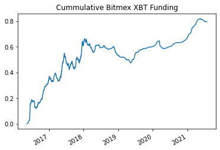
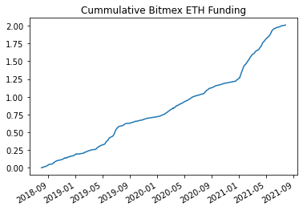
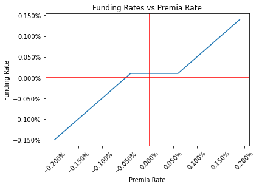
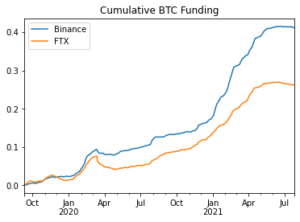
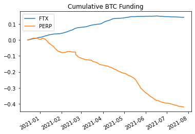
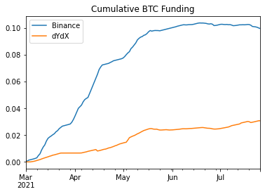
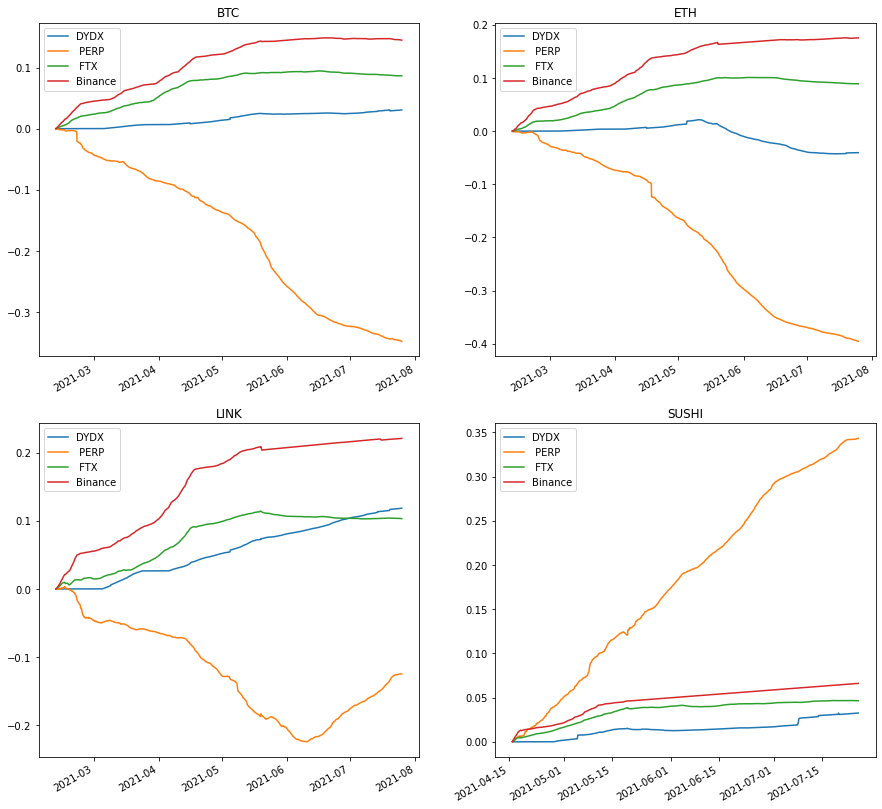

Title: Perpetual Futures Funding
Slug: perp-funding
Date: 2021-07-28
Tags: Futures, interest rates
Summary: Understand and compare funding mechanisms of various platforms

<h3>Background</h3>

Bitmex <a href="https://blog.bitmex.com/announcing-the-launch-of-the-perpetual-xbtusd-leveraged-swap/" target="_blank">created</a> the first perpetual future in the crypto space which allowed traders to trade with leverage while not rolling each month of each quarter.
The perpetual swap used an innovative mechanism of funding rate to make sure the market price does not stray too far from the index price of an asset. 
Holders of the swap pay/receive payments every 8 hours based on the delta between the market price and the index price.
If the market price is greater than the index price, the longs pay the shorts (encouraging the price to go down) and vice versa.

The funding rate can be thought of as the interest rate of the crypto ecosystem as people lend dollars for others to speculate with leverage.
A very popular delta neutral trade is to capture this funding rate by buying the underlying BTC and hedging short the corresponding amount of BTC futures.
As long as the funding rate is positive, the long speculators will pay the short hedgers and the shorters can collect this "risk-free" rate[ref]There are exchange custodial risks, execution risk, as well as liquidation risk depending on how the trade is structured.[/ref].
Below is a cumulative sum of the funding rate from the start of the BTC contract[ref]Bitmex calls BTC XBT[/ref] till present. 
We can see that the funding rate is typically positive apart from when volatility dries in the bear market of 2018-2020.

ETH is even more lopsided as we have over 200% returns on a delta neutral strategy in around 3 years, giving an annualized return of over 60%[ref]This would be higher due to compounding.[/ref].
These high rates are possible because speculators want to use leverage for more gains and they believe that the price appreciation of $BTC or $ETH will be larger than the premium paid to funding[ref]And to these speculators credit, the returns of $BTC and $ETH have outpaced that of the funding.[/ref].

<h3>Bitmex Calculation</h3>

There are a few formulas to calculate the funding rate for each asset and it differs exchange by exchange.
Note that the funding rate is rate exchanged between two users: if the trade price is greater than the index price funding is positive and then long speculators pay short speculators.
Vice versa if the trade price is less than the index (mark price), funding is negative and short speculators pay long speculators.
The funding rate for BitMex is broken down into two main parts, a fixed interest rate component I and a premium index component P. 

The interest rate portion is fixed and for <a href="https://www.bitmex.com/app/contract/XBTUSD" target="_blank">$BTC</a> it is always .01%.
For $BTC we have Q as 0.06%, I as 0.03%, and T as 3 because there are 3 8 hour intervals in a day.

\begin{align}
I &= (Q-B)/T\\
I &= (0.06\% - 0.03\%) / 3\\
I &= .01\%\\
\text{where} & \\
I &= \text{Interest Rate} \\
B &= \text{Interest Base} \\
Q &= \text{Interest Quote} \\
\end{align}

The premia portion is based around the delta between the trade price and the mark price, but there are a few twists which impact this calculation.
Bitmex introduces a concept called Fair Price Marking to try and reduce liquidations by setting the Mark Price to be equal to the Fair Price instead of the Last Price.
Impact Bid Price and Impact Ask Price which are tied to how thick the order book is.
Impact Bid Price is average fill price if 10k USD[ref]This is known as Impact Notional Value and is a parameter that varies product by product as well as exchange by exchange.[/ref] were sold while Impact Ask Price is the average fill price if 10k USD were bought[ref]These numbers are for all perpetual futures, other impact numbers will vary[/ref].
Fair basis takes the most recent funding rate and decays the value throughout the next period. 

\begin{align}
P &= \frac{(Max(0, IBP - MP) - Max(0, MP - IAP))}{SP} + FB\\
FB &= PFR * (TUF / FI)\\
\text{where} & \\
P &= \text{Premium Rate} \\
IBP &= \text{Impact Bid Price} \\
MP &= \text{Mark Price} \\
IAP &= \text{Impact Ask Price} \\
SP &= \text{Spot Price} \\
FB &= \text{Fair Basis used in Mark Price} \\
PFR &= \text{Previous Funding Rate} \\
TUF &= \text{Time Until Funding} \\
FI &= \text{Funding Interval} \\
\end{align}

Finally, putting it all together we have the funding rate which is a combination of the premium plus a cap based on difference between interest rate and premium.
In addition, note that the premium rate and interest rate are TWAPs over the 8 hour interval.

\begin{align}
F &= P + Clamp(I - P, -0.05\%, 0.05\%)\\
\text{where} & \\
F &= \text{Funding Rate} \\
P &= \text{Premium Rate} \\
I &= \text{Interest Rate} \\
\end{align}

The clamp is interesting it inherently locks the funding rate to .1% (every 8 hours) as long as the premium index is between -.04% and .06%.

To recap, Bitmex funding is paid every 8 hours, 4UTC, 12UTC and 20UTC.
The funding price is derived from a linear formula with two main portions being a constant interest rate (.1%) and a changing premium rate.
The premium rate is a proxy for the delta between the futures price and the index price.

<h3>Binance Calculation</h3>

Binance is the most popular futures exchange with volumes that dwarf competitors and a vast array of altcoins to choose from.
All of these exchanges have similar formulas with slight adjustments and <a href="https://www.binance.com/en/support/faq/360033525031" target="_blank">Binance</a> is no different as it has the exact same interest rate formula and funding rate formula, but the premia rate formula is slightly different.

The main difference is that there is no mention of the fair basis thus no decay of the previous funding rate. 
In addition, the IBP and IAP calculate the average fill price if the impact notional was 25k USD as opposed to 10k from Bitmex.
This is also more dynamic than Bitmex as Bitmex is 10k impact for all perpetual futures while Binance is more realistic and adjust this parameter based on volume and market cap of various coins.
Finally, Binance also has 8-hour payments but this payment occurs at 0UTC, 8UTC, and 16UTC.

\begin{align}
P &= \frac{(Max(0, IBP - MP) - Max(0, MP - IAP))}{SP} \\
\text{where} & \\
P &= \text{Premium Rate} \\
IBP &= \text{Impact Bid Price} \\
MP &= \text{Mark Price} \\
IAP &= \text{Impact Ask Price} \\
SP &= \text{Spot Price} \\
\end{align}

<h3>FTX Calculation</h3>

One of the fastest growing exchanges is FTX and they a more unique <a href="https://help.ftx.com/hc/en-us/articles/360024780511-Complete-Futures-Specs" target="_blank">approach</a> towards funding rates.
Funding is calculated hourly and is just a simple TWAP of the percentage difference between market price and index.
Here market price is the median of last, best bid, and best offer. 

\begin{align}
F &= TWAP(P)/24 \\
P &= (MP - IP)/IP \\
\text{where} & \\
F &= \text{Funding Rate} \\
P &= \text{Premium Rate} \\
MP &= \text{Market price which is median of last, best bid and best offer} \\
IP &= \text{Index Price} \\
\end{align}

The biggest difference is that there is no .1% interest rate built in like Bitmex and Binance.
FTX rates should be lower than the other two due to this tidbit and thus and more favorable to long speculators.
Looking at the graph below we can indeed confirm this case as FTX has a substantially lower funding rate.

<h3>Perpetual Protocol Calculation</h3>

There are two major ones decentralized futures exchanges, Perpetual Protocol (PERP) and dYdX.
Currently PERP runs on the xDai layer 2 chain with a <a href="https://medium.com/perpetual-protocol/a-deep-dive-into-our-virtual-amm-vamm-40345c522eeb" target="_blank">vAMM mechanism</a> which uses the same xy=k formula as Uniswap.
That formula is a price discovery mechanism but there is no actual spot trading as there is USDC collateral backing the pool which will be paid out for profitable trades.

The funding formula is the exact same as FTX, amd funding price is also paid hourly, but the index price is from Chainlink as opposed to FTX median price due to there being no orderbook.
Because they have the same formula we can easily compare[ref]Note that PERP only launched December of 2020[/ref] the cumulative funding for the two. 
However, we can easily see a stark difference as PERP funding has been negative this entire time while FTX is positive.
This means that the $BTC price on PERP is consistently lower than that on FTX and the shorts pay the longs.
The dichotomy hints that people are shorting BTC on chain much more actively than on the centralized exchange.

<h3>dYdX Calculation</h3>

dYdX is the other popular decentralized futures exchange and its <a href="https://help.dydx.exchange/en/articles/4797443-perpetual-funding-rate" target="_blank">funding formula</a> is almost identical to Binance, but the calculations Impact Bid Price and Impact Ask Price have different amounts of impact notional value.
In addition, there is a cap on the minimum and maximum funding rate of -0.75% and 0.75% respectively which can be seen by the double clamp formula below.

\begin{align}
F &= Clamp(P + Clamp(I - P, -0.05\%, 0.05\%), -0.75\%, .75\%) \\
\text{where} & \\
F &= \text{Funding Rate} \\
P &= \text{Premium Rate} \\
I &= \text{Interest Rate} \\
\end{align}

Below there is the comparison between Binance and dYdX as they use almost identical interest rate formulas. 
We can see the Binance funding be substantially higher, a similar trend to the FTX vs PERP funding where the centralized exchange has higher funding than the decentralized one.
This could also be due to the market microstructure of the players as the DEXs are more novel and require a higher level of sophistication to use compared to the CEXs which could have more retail which likes to use high leverage and go long, increasing the funding on those exchanges.

<h3>Comparisons</h3>

There are a few other altcoins which are on all 4 exchanges. 
Some of these coins do not have that much data as PERP and DYDX just launched and are still putting new markets out but below we compare at the $BTC, $ETH, $LINK, and $SUSHI markets which all have at least a few months of data.
There is vast divergence between the exchanges for some reason PERP seems to be consistently lower funding for some of the $BTC, $ETH, and $LINK, but it is the highest for $SUSHI.

<h3>Liquidations</h3>

It is worth noting that each exchange has different liquidation rules which impacts the max amount of leverage one can safely use on an exchange and putting on a delta hedged trade across exchanges has a non-zero amount of liquidation risk.
Binance has more aggressive liquidations which market sell a currency leading to cascading liquidations.
The impact can be seen on <a href="https://www.coindesk.com/binance-controls-flash-crash-polkadot" target="_blank">DOT</a> which dropped over 99% from $30 to $0.2 and <a href="https://www.cryptonary.com/journal/flash-crash-18-april-2021-whats-next/" target="_blank">REN</a> which tanked from $1 to $.1 in a matter of seconds. 
On the DEX side, PERP has also seen its fair share of controversy with <a href="https://medium.com/perpetual-protocol/2021-2-21-btc-flash-crash-149eef35f7f8" target="_blank">BTC</a> crashing 20k in an hour and then a few months later in <a href="https://perpetualprotocol.medium.com/2021-4-18-flash-crash-19d9a1a16047" target="_blank">ETH</a> which dropped over 50% in a few minutes.
The liquidation rules ultimately tie back into how much leverage and size one can put on for a delta-neutral trade and thus the corresponding funding rates. 

<h3>Conclusion</h3>

Due to the intricacies of calculating funding rates, the microstructure of the markets, and the different liquidation risks, each exchange has differing funding rates.
If one were to implement strict risk management rules, spreading between the exchanges and collecting the funding rates could be a promising delta neutral trade.

