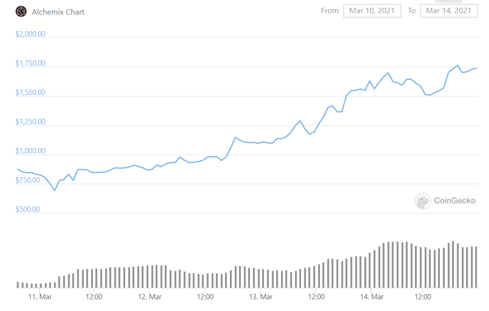

Title: Pool 2 Emissions 
Slug: emissions-brr
Date: 2021-05-04
Tags: DeFi, $RULER, $ALCX, $FLOAT, $BASK
Summary: Looking at governance contains alpha.

<h3>DAO Emissions</h3>
Decentralized autonomous organizations or DAOs are internet native businesses that are managed buy their members.
Members discuss and vote on various topics for the future direction of the protocol. 
There are certain advantages of this as everything is on the blockchain so there is no need to trust other members, everything is verifiable from code.
In this recent defi boom, many DAOs have sprung up and like our previous article about [voting](./voting-gaming.html) front running pool 1s, we can also front run protocol token emission changes.

Protocols often give out their governance token to bootstrap interest. 
Sometimes these tokens are given through yield farming while other times it is from protocol usage.
Usually these protocol tokens are farmed and dumped on the pool 2 liquidity providers causing a negative price loop in the token as there is rampant inflation.
Token holders will often times act in their best interest and try to decrease the emissions from the farming pools and increase emissions to pool 2.
In this article we will look at a few occurrences of when this happened and the following price action of the underlying token.

<h3>Ruler Protocol</h3>

Instead of price based liquidations, $RULER is unique in that it is time based liquidations. 
Like AAVE or Maker, borrowers deposit risky assets as collateral and can receive stable coins in return, but there is no health factor to pay attention to.
As long as the stablecoins are returned by the end of the borrow period (currently it is monthly) along with set interest, the risky assets are returned. 
If the stablecoins are not returned, the lender claims the collateral which gives the lender an inherent put option. 
If the collateral drops below the stablecoin borrowed, there is no incentive to repay the borrowed stablecoins.

To bootstrap liquidity and interest in the product, $RULER was given to those who used the platform to provide loans[ref]It was actually given to those who provided liquidity to the loans which were tradable on Sushiswap[/ref]. 
Ruler <a href="https://rulerprotocol.medium.com/ruler-protocol-launch-announcement-cc75385ad134" target="_blank">launched</a> on March 3rd, and people immediately started to use the product to get $RULER and then sell for $ETH.
Below you can see the price action which was just a straight line down:

This obviously made the token holders upset so they started to try to reverse this price action and eventually submitted a few ideas in the <a href="https://forum.rulerprotocol.com/t/draft-rep-02-operation-measured-increase/78" target="_blank">forums</a>.
One of the ideas to reduce the $RULER emissions from using the protocol and increase the pool 2 emissions got a decent amount of traction and was submitted to a vote on <a href="https://snapshot.org/#/rulerprotocol.eth/proposal/QmVpjtr6VtGSE8FfMFBUM7gEKuwsHiUGbibwiKHgj8UwMq" target="_blank">snapshot</a>.
Long story short, this would greatly increase the yields of the liquidity providers in pool 2 by 50% while cutting other emissions by 45%-90% which is very bullish for short term price action.
This proposal passed and ruler appreciated 200%+ in the next coming days.

We see a rapid bid after the proposal got accepted and started to get some traction on March 19th when the price went from a low of around $160 to $320 and then over $400 on March 23rd.
The vote was note particularly close, over 99% voted in favor of reduced emissions which makes sense as the main beneficiaries of this proposal are those token holders and only token holders can vote.
The information is technically known around March 14th, when the forum got a lot of views to send the proposal to a vote which happened around 5 days later. 
Whenever we see a vote for an emissions change which reduces the sell pressure by reducing emissions in the amount on coins being sold and increasing emissions in the liquidity providing pool, it is usually a very bullish short term sign.
There is no reason to wait till the end of the vote to buy, game theory dictates that the vote passes in almost every instance.

<h3>Alchemix</h3>

Continuing on the DeFi lego block narrative, Alchemix builds upon Yearn and allows for instant value borrowed against future yield. 
Basically depositing 100 $USDC into a Alchemix gives up to 50 dollars of $alUSD, which can be swapped back for stablecoins. 
The deposited $USDC is put into Yearn vaults and the interest automatically repays the users debt which in this case is 50 dollars of $alUSD. 
The key innovation[ref]I do not believe that there is product market fit and that this should just be a yearn feature as opposed to a new protocol[/ref] is automatic debt repayment with interest.

Like Ruler Protocol, Alchemix gave out large inflation rewards of its governance token $ALCX to users of the protocol causing price to drop and the token holders started to discuss <a href="https://gov.alchemix.fi/public/d/16-aip-3-increasing-share-of-emissions-going-to-alcx-holders" target="_blank">emission reductions</a> on March 11th.
A vote was <a href="https://snapshot.org/#/alchemixstakers.eth/proposal/QmedGhedXebdpTbgw67R9A2xSmY2SuJh8swu6sFCsGbTd7" target="_blank">held</a> that same day and implemented on the 12th. As you can probably guess, the token price went bonkers again from a low of around 750 to 1750.

<h3>Float</h3>

We briefly talked about Float protocol in the last voting gaming article, but a very similar situation happens. 
This is a copycat market and after Alchemix and Ruler successfully increased their token price short term, other struggling tokens took notice and implemented same proposals.
Here we have a <a href="https://forum.floatprotocol.com/t/fip-003-end-phase-2-and-introduce-phase-3/194" target="_blank">forum post</a> in Float on March 23 and a <a href="https://snapshot.org/#/snapshot.floatprotocol.eth/proposal/QmUyLoX5M96FeV1Axjp99AXFgJXCXGPEMwyG4u45VG7x8H" target="_blank">vote</a> a few days later.
The token price increased from a little under $800 to a little over $1000.

<h3>Conclusion</h3>

Because this is all new territory, there are not really best practices for Daos, so we see teams iterating (or copying) each other at very fast speeds.
At times these coins are difficult to trade, but using game theory and working out the edge cases to see how each new proposal impacts the underlying token price can lead to a decent amount of edge.

