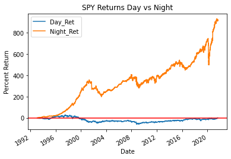
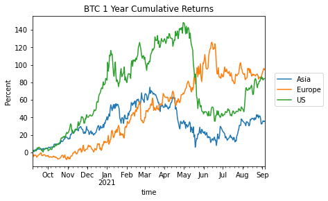
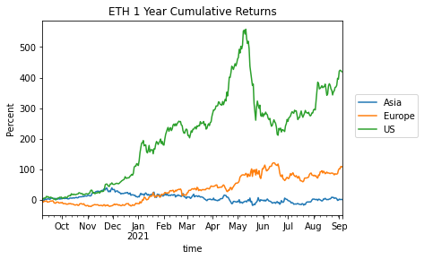
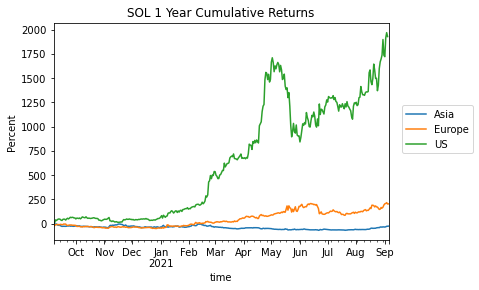
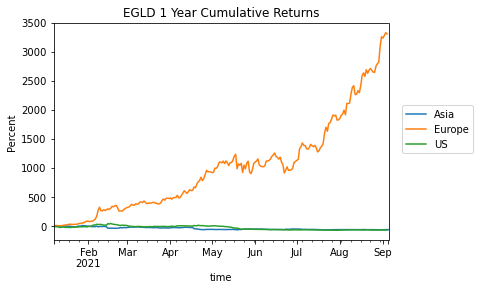

Title: Intraday Seasonality in Crypto
Slug: time-of-day
Date: 2021-09-05
Tags: crypto
Summary: Different hours have different characteristics

<h3>Background</h3>

The SPY was created in 1993 and it is an ETF tracking the S&P 500 which has gone up over 10x from then till present day. 
What if I told you that all those gains occurred after hours[ref]After the market closed from 4 PM EST till 9:30 AM EST the following day.[/ref] and the performance during the market open was basically flat?
Below is a chart of this phenomenon. 
We can steady gains in the after market periods up until Covid, when we were getting news bombs at night from China, thus tanking the market during the overnight period. 
That ended up being a temporary blip and the after hours gains started to come back after a few weeks. 
More importantly, from the inception of the SPY till present day, the cumulative performance of the SPY when the market[ref]9:30 AM EST till 4:00 PM EST[/ref] is less than 1%.

This abnormal performance holds in all types of markets, from individual stocks in various sectors to the equity indices.  
Some hypothesis are that the after hours are when news (earnings, buyouts) comes out and these are typically bullish events. 
Others relate to the market microstructure and the fact that there are tighter <a href="https://www.cmegroup.com/education/files/eq-trading-hours.pdf" target="_blank">circuit breakers</a> after hours.
A more in-depth examination can be found in <a href="https://www.krannert.purdue.edu/faculty/hgulen/Day_and_Night.pdf" target="_blank">these</a> <a href="https://papers.ssrn.com/sol3/papers.cfm?abstract_id=1625495" target="_blank">papers</a>.

<h3>Crypto Sessions</h3>

Crypto trades 24/7/365 but not all hours have the same market dynamics as the participants change as we shift from Europe to US to Asia sessions.
The trading periods are as follows[ref]These times actually follow the Bitmex perp funding schedule[/ref]:

<ul>
  <li>4:00 - 12:00 UTC is Europe Session</li>
  <li>12:00 - 18:00 UTC is America Session</li>
  <li>18:00 - 4:00 UTC is Asia Session</li>
</ul>

An interesting study is to break down returns by time period and compare to see if some time periods are more bullish or bearish than others.
We can see if Asia session <a href="https://twitter.com/AltcoinPsycho/status/1350705185761456129" target="_blank">bearish</a> bias is warranted. 
Below is the cumulative return chart of $BTC broken down into the three sessions above. We can see that the Asian session had the worst performance out of the three only increasing 40% while both the US and European sessions had over 80% increases.
Counter intuitively, the China mining ban had the largest negative impact on US hours not Asian hours. Before the ban in April, Asian session was tracking with the Europe session but since then they have been on divergent paths.

We can extend this study to other coins like $ETH and $SOL. It is interesting to see that $ETH has actually gone down in Asian hours while the US hours is extremely bullish. 
The Asia $ETH session looks like a TWAP sell algo which could mean miners hedging and selling either coins as most of the miners are in Asia. 
The dichotomy between the sessions is even starker on $SOL. 
There is a relentless US session bid that dwarfs any other time period and my best guess is that it is institutions/VC.

We can extend this study to other coins like $ETH and $SOL. It is interesting to see that $ETH has actually gone down in Asian hours while the US hours is extremely bullish. 
The Asia $ETH session looks like a TWAP sell algo which could mean miners hedging and selling either coins as most of the miners are in Asia. 
The dichotomy between the sessions is even starker on $SOL. 
There is a relentless US session bid that dwarfs any other time period and my best guess is that it is institutions/VC.

<h3>When do Apes Ape?</h3>

From the previous plots it would seem that the US session is when all the gains are made and the Asia session is when they are lost. 
This changes from coin to coin as oftentimes it is the Europe session that has massive gains, but for most of the coins the Asian session is the worst session in terms of performance and the difference is stark.
Below are some other L1s which exhibit insane gains during the Europe session when compared to other sessions. 
The differences are so stark, I went back to double check if there was a bug in the code.
Both $AVAX and $EGLD just repeatedly rip during one session and stay still for the other two, almost like there is a TWAP bid every Europe session, but goes into profit taking mode outside the European hours.

<h3>Conclusion</h3>

Here we examined some time of day discrepancies between various assets. Some assets like $ETH and $SOL seem to only move during the US hours, while others move during the European session. 
This information can be used in a variety of ways from outright trading to risk management (increasing/decreasing leverage as the potential moves are more/less likely in certain times).
The article focuses mainly on intraday seasonality, but the same concept can be extended to various days of the week and days of the month. 
In addition, a next step could be to condition on some funding and OI data to see how the results change.

