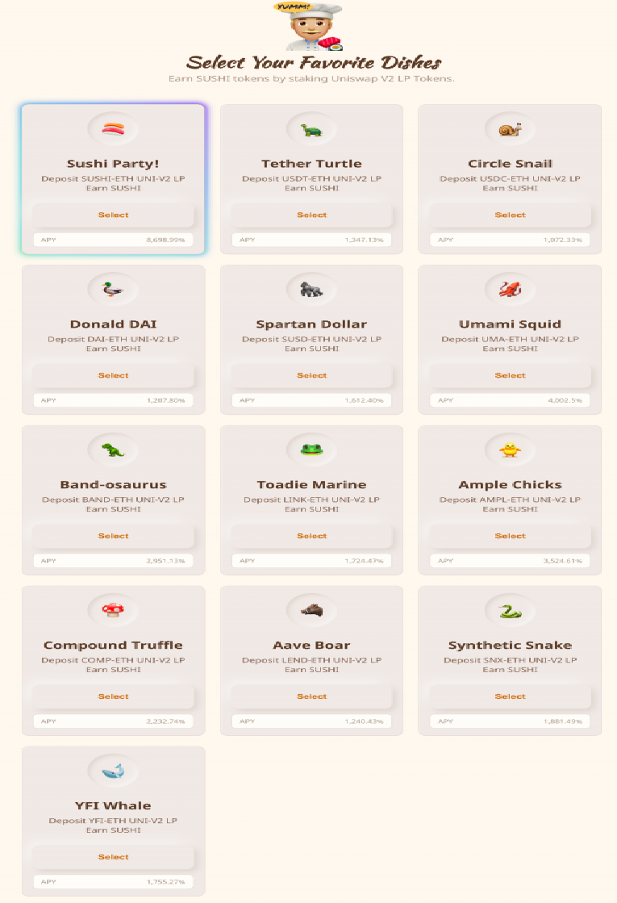
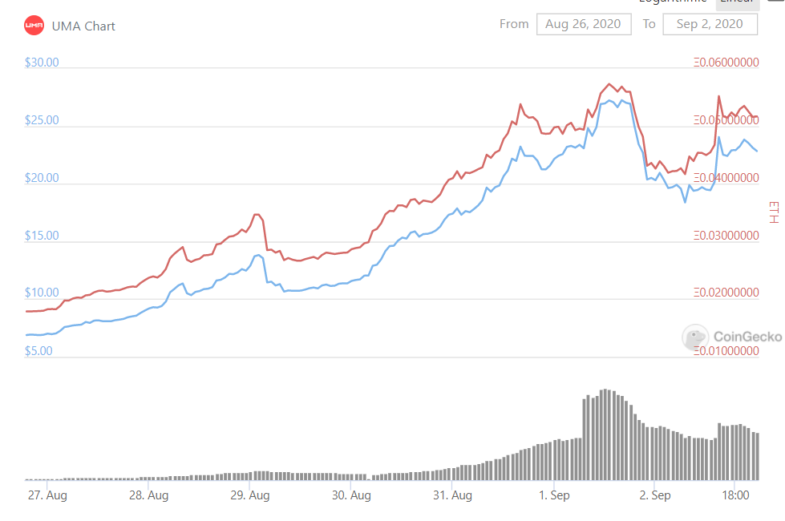
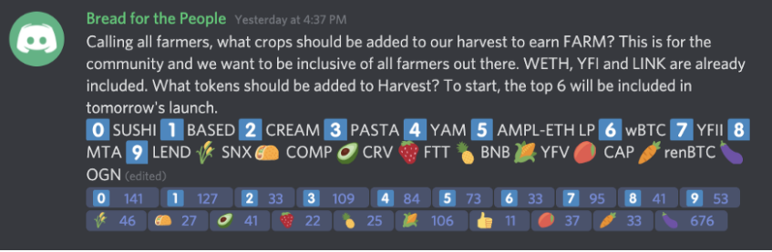
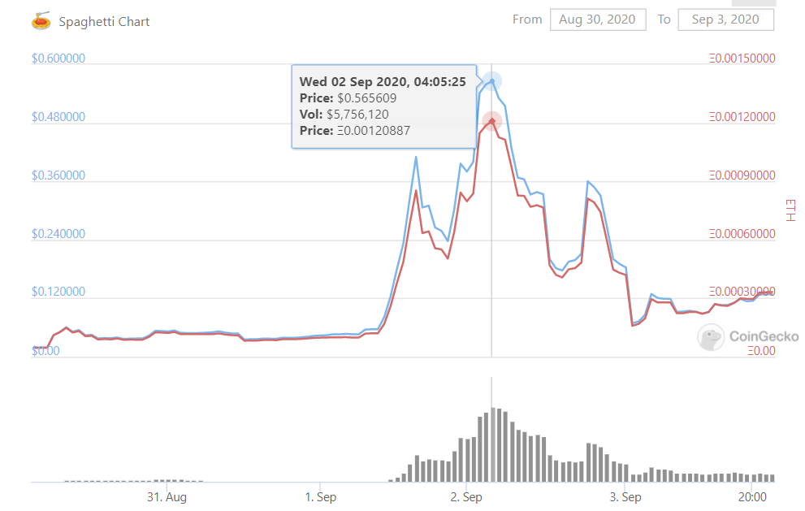
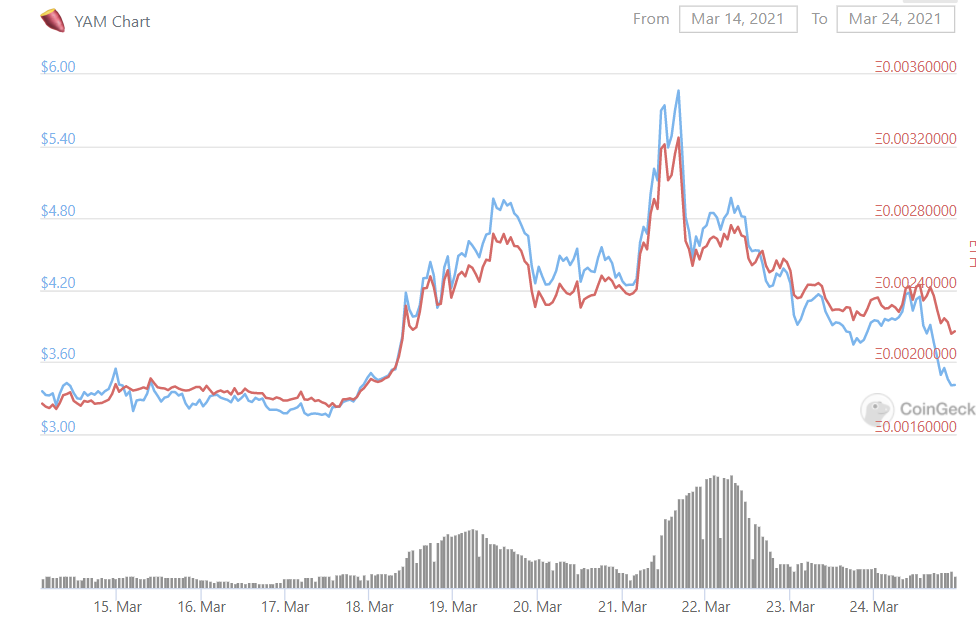

Title: Voting Pumps
Slug: voting-pump
Date: 2021-03-22
Tags: $FARM, $PASTA, $YAM, $BANK
Summary: Voting random old coins to farm new coins often creates lucrative oppurtunites for the old coin.

<h3>Background</h3>

DeFi protocol fair value pricing is a mix of modeling technology on its standalone future cash flows, relation value in relation to other DeFi projects, and then game theory to see how incentives (tokenomics) align with the price.
This article will focus on the latter game theory aspect: in a particular case of the farming pump.
DeFi protocols often use farming (liquidity mining) to bootstrap interest in their project, give the community some tokens, and create liquidity for said token.
These can range from safe stable coin farms, single asset farms, to riskiest pool 2 farms. 

For those who are unfamiliar with the farming craze, a stable coin farm is when \$USDC, \$USDT, \$DAI and other stable coins are deposited in return for a protocol's token.
This is pretty risk free as the value of the stable coin wont deviate and then people are just getting the token for free[ref]It is often during these times that stable coin borrowing rates on AAVE get expensive as people try to borrow stablecoins to farm free tokens at a higher borrowing rate.[/ref]
[ref]Many of the first DeFi farms were stable coin farms like Yearn.[/ref]
[ref]There is always smart contract risk. DYOR before interacting with these farms and be sure to revoke permissions afterwards[/ref].
A single asset farm is when other assets are deposited in return for a protocol's token. 
One of the first single asset farms was \$YAM, when it allowed other DeFi tokens like \$SNX and \$YFI to be deposited to recieve \$YAM. 
This is inherentely riskier as the tokens from other protocols may increase or decrease in price, removing the risk free value catpure from stable coins
[ref]For this extra risk, the yield on these single asset farms are often times multiples higher than stable coin farms.[/ref]
[ref]Often times yield farmers will use futures on centralized exchanges to hedge out the delta risk of the various single asset tokens, thus creating a synthetic dollar and getting the yield "risk free"[/ref].

Continuing on the risk specturm there are the \$SUSHI ETH LP token farms and finally the riskiest \$1inch pool 2 (deathpool) farms[ref]If there is interest I can write another article on the intracacies of the various farms as there is also a decent amount of game theory at play there[/ref].
The latter two use liquidity provider tokens from AMMs to create more liquid markets. 
The Sushi ETH pairing farms are not that much risker from a pricing standpoint as \$ETH is relatively liquid and typically has lower volatility than the single asset funds, however in deathpool farms one can lose both deathpool tokens.
Most of the time, the non-stablecoin farms will have some combination of the popular large coins like \$ETH and \$WBTC, and then maybe some DeFi "Blue Chips" (\$YFI, \$AAVE, \$SNX).

Often times a picture is worth a thousand words, so here is the front end of the sushiswap farm from late august. 
The APYs vary substaintially from LEND-ETH around 1.24k% to UMA-ETH at 4k% to SUSHI-ETH at 8.7k%.
Besdies farming in the SUSHI-ETH pool which has its inflation issues, the next best trade is to farm the UMA-ETH pool because it has the highest APY.
It has the higest APY, because all the pools give out the same about of \$SUSHI per <a href="https://web.archive.org/web/*/https://medium.com/sushiswap/the-sushiswap-project-c4049ea9941e" target="_blank">block</a>, but \$UMA has one of the smallest mcaps so natrually its APY is higher.
This caused people to bid up \$UMA in order to chase the apy and \$UMA went from $6 to $24. 
The exact trickle down effect goes something like this:
<ol>
  <li>All the pools (other than SUSHI-ETH) distribute the same amount of \$SUSHI daily.</li>
  <li>The pools tied to the smallest market cap tokens to have the highest APY.</li>
  <li>People purchase the coin and try to balance out the APYs between various pools.</li>
  <li>Coin price rises as the coin is not very liquid in the first place.</li>
</ol>

After that long winded intro on farming, we now come to the interesting portion of various trades one can do during farming.
There are certain cases when the members of the protocol get to vote which coins are eligible for liquidity mining and it is in these unique cases that there are often outsized risk/reward trades and the primary focus of this article.
Fundamentally speaking these coins that are used for liquidity mining gain a lucrative short term usecase and thus their underlying value appreciates during this time period.
I will highlight two different cases below with Harvest Finance and Float Protocol. 

<h3>Harvest</h3>

Harvest Finance is one of the first Yearn clones and in late August 2020 and they used discord to vote for coins to farm their new token \$FARM. 
Each member of the discord is allocated one vote and the results are below.

We can see that \$SUSHI, \$YFII, \$YFV, \$OGN, \$BASED, and \$PASTA, ended up <a href="https://medium.com/harvest-finance/harvest-reward-pools-launch-60d1dcbc4b81" target="_blank">winning</a>.
For those of you that are unfamiliar with these coins, they are all shitcoins, but some are more trash than others due to their low liquidity. 
Enter \$PASTA, a meme food coin with no use case created just over two weeks ago to farm and dump. 
At the time of the vote, this coin was trading around 1 cent and 100k market cap, but by the time the vote had concluded, it touched 50 cents with a 5 million market cap and 5 million daily volume.
The sole purpose of \$PASTA was as a liquidity mining token for \$FARM, the Harvest Finance token.
Below is the astonshing 50x from 8/31 to 9/2.

A closer look at the final tallies reveals that \$PASTA ended up in 4th place with 109 votes and 6th place went to \$AMPL with 73 votes. 
Only 109 discord votes were cast to create this ridiculous pump. 
Discord accounts require a unique email and emails can be created for free so all this trade required was a few hours of fake emails.

<h3>Float Protocol</h3>

Voting has evolved since the early days of DeFi summer and now most projects use snapshot/scattershot which requires the underlying token. 
A snapshot of all the addresses holding the underlying token is taken at a specific block time and then each token is given 1 vote. 
It is still is still possible to create large movements in illiquid tokens through the farming pump, but now it will require some risk to capture votes instead of free discord accounts.

Float protocol is a unstable coin loosely pegged to the dollar. 
There was a phase 1 whitelist, in which <a href="https://medium.com/float-protocol/float-protocol-bank-distribution-whitelist-expansion-fd5a84c42356" target="_blank">certain</a> wallets where able to use stablecoins to farm their native token \$BANK.
Then phase 2 allowed the top 5 coins from a <a href="https://scattershot.page/#/snapshot.floatprotocol.eth/proposal/Qmf3rzXtVTvox5QoJ7LEgR7cXAqL2PetuAFGihZXiRNXFp" target="_blank">vote</a> to also farm.
This vote lasted 4 days (from 3/14/2021 to 3/18/2021) and the top 5 vote getters where \$YFI, \$YAM, \$SUSHI, \$ETH, and \$wBTC.
Out of these 5, only \$YAM has a market cap under 100 mil and pumped due to its addition as a eligible farming token.

The a similar low cap voting pump played out here.
On 3/10/2021, a team member from Float created a phase 2 <a href="https://forum.floatprotocol.com/t/fip-02-phase-2-plans/15" target="_blank">proposal</a> to see which of the new coins would be farming Float's underlying token \$BANK.
After a few days of discussion, the <a href="https://forum.floatprotocol.com/t/fip-02-phase-2-plans/15/105" target="_blank">snapshot</a> was taken on 3/12/2021, when \$Bank was roughly \$700.
There were 3.49k \$Bank votes (1 \$Bank equals 1 vote) for \$Yam and the 5th place token had around 3.26k votes. 
It would cost rouhgly 2.4 mil for all of the \$YAM votes[ref]It would cost around 2.3 mil for 5th place.[/ref].
Due to this vote, \$Yam price went from around 3.5 to a high over 6 and the market cap went from around 40 mil to 70 mil. 
Not as lucrative in percentage terms as Harvest, but this trade could take alot more size and still was very attractive from a risk rewards standpoint[ref]There are also no futures of \$YAM so is hard to get a short and farm risk free. Thus the \$YAM pool would have alot less TVL and thus higher APY.[/ref].

Below is the price action for \$YAM. 
We can see a increase near the close of voting as we see \$YAM was voted in and then one final spike at the beginning of farming right when farming is about to start on 3/21/2021.
Unfortunately the price slowly fell off a cliff as voters decided to shorted phase 2 to 1 week through another proposal, but the initial trade was still very promising.

<h3>Conclusion</h3>

There are many examples other examples farming pumps like Harvest and Float where community members can vote in illiquid altcoins for farming collateral.
These types of trades should continue to be high expected value trades in the current bull market.

