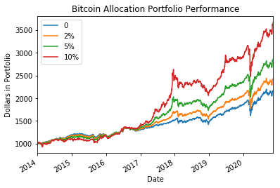
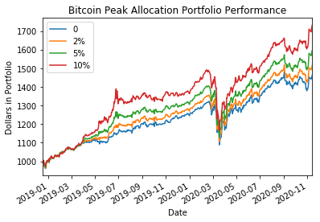
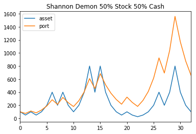
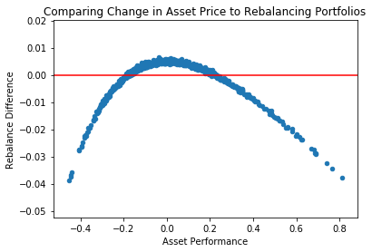

Title: Bitcoin for the Portfolio
Slug: btc-portfolio
Date: 2020-11-14
Tags: $BTC, investing
Summary: Bitcoin can help a portfolio increase performance in both absolute and risk adjusted metrics.

<h3>Background</h3>

I am a Bitcoin permabull, so my views on Bitcoin are definitely biased. 
There are numerous fundamental reasons why I believe it is poised to revolutionize the financial industry as we know it, but I will save those arguments for a future post.
This article will use statistics to show why allocating bitcoin to your portfolio has historically been beneficial on both an absolute and risk adjusted basis.

The traditional retirement portfolio is the 60/40 portfolio, where 60% of the portfolio is in various equities and 40% is in some form of fixed income. 
Typically portfolio managers rebalance this 60/40 portfolio quarterly to keep the same exposure to both asset classes.
Using $SPY and $TLT as proxies for equities and fixed income, we can simulate the performance of a 60/40 portfolio during this decade long bull market.
The following plot shows a 60/40 portfolio with $1000 dollars starting in 2014 till present day. 
This portfolio had pretty consistent performance until the Covid crash in 2020 and there is strong risk adjusted performance.
In addition, I show what would have happened if instead this portfolio had 2%, 5%, and 10% exposure to $BTC in addition to the equity and fixed income exposure. 
I remove equal exposure from the two assets so at 2% $BTC exposure, we also have 59% equity and 39% fixed income exposure.

|      | Total Return | CAGR | Max\_dd | Sharpe | Sortino |
|------|-------------:|-----:|--------:|-------:|--------:|
| 0    |         1.17 | 0.10 |   -0.18 |   1.04 |    1.06 |
| 2%  |         1.43 | 0.12 |   -0.18 |   1.16 |    1.22 |
| 5%  |         1.86 | 0.14 |   -0.20 |   1.23 |    1.30 |
| 10% |         2.67 | 0.18 |   -0.22 |   1.19 |    1.28 |

The more $BTC we add to a portfolio, the better it does from an absolute return perspective. 
For the risk adjusted performance, it seems that 5% BTC with 37.5% fixed income and 57.5% equity exposure was the best. 
The above statement probably seems obvious in hindsight as $BTC went from less than $1,000 to over $16,000 during this time period. 
What I want to stress is that including $BTC in the portfolio increases the risk adjusted returns of the portfolio by over 20%.

<h3>Crypto Bear Markets</h3>

Bitcoin has numerous periods that it has significant draw downs as it is a very volatile asset. 
However due to a phenomena known as Shannon's Demon or volatility harvesting, a portfolio including Bitcoin can still outperform one without Bitcoin during these drawdown periods.
This can be easily visualized if we start the portfolio with 1000 dollars at all time high of $BTC of 19,000 on December 18th, 2017.
On this date, $SPY is around 250 and $TLT is around 120. 
Fast forward to today and $BTC is around 16,300, $SPY is at 360 and $TLT is hovering around 160.
Absolute return wise, both $SPY and $TLT outperformed $BTC.
However, when we add $BTC to the re-balanced portfolio, we see that the portfolio with the best relative and absolute performance is actually the one with the most $BTC exposure at 10%.

|      | Total Return | CAGR | Max\_dd | Sharpe | Sortino |
|------|-------------:|-----:|--------:|-------:|--------:|
| 0    |         0.46 | 0.19 |   -0.18 |   1.39 |    1.37 |
| 2%  |         0.52 | 0.21 |   -0.18 |   1.51 |    1.54 |
| 5%  |         0.59 | 0.24 |   -0.20 |   1.61 |    1.64 |
| 10% |         0.72 | 0.28 |   -0.22 |   1.65 |    1.66 |
 
<h3>Shannon's Demon</h3>

$BTC works well in the above portfolio, because it is an uncorrelated asset.
Although it produces a negative return on its own, there are large diversification benefits to adding it to a equity-fixed income portfolio.
The power of diversification and rebalancing is shown clearly in the following made up example:
Suppose there is an asset that either doubles or halves at every time step. 
In addition, it starts and ends at the same price.

In the example below, the price of this asset starts and stops at 100, but by rebalancing, the price of the portfolio ends at over 600, more than 6x the original starting point.
Obviously this is an extreme example, but it properly illustrates the power of rebalancing under a mean reverting asset.

We can use monte carlo simulations to look at more realistic scenarios of possible performance from rebalancing. 
Rebalancing is not a magical panacea and there are places where it underperforms not rebalancing.
I generate 1000 synthetic streams from a random Gaussian process with 250 data points, setting the mean to zero and an annualized 20% standard deviation.  
Each day I do a 50-50 rebalance with cash and then compare the performance against a non-rebalancing portfolio at the end of the time period.
As we can see in the below graph, rebalancing a portfolio gives a payoff similar to selling options on the underlying.
When the underlying does not move that much, rebalancing is plus EV, but if there are extreme moves then it is negative expected value.
We see that when the asset moves less than 20% in either direction, rebalancing is better than holding.
Out of 1000 iterations over 2/3rds of them did better when rebalancing.

<h3>Conclusion</h3>

Rebalancing assets is a powerful way to increase both absolute and relative returns.
$BTC is the ultimate asset for a traditional portfolio, because it is uncorrelated to traditional assets.
Readers should consider adding a small portion of portfolio to Bitcoin and periodically rebalance the new portfolio.

