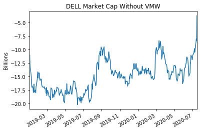

Title: Dell VMWare split
Slug: dell-vmware
Date: 2020-07-18
Tags: investing, $DELL, $VMW
Summary: How to trade the Dell VMWare split

Dell Technologies, \$DELL, owns 81\% of VMware, \$VMW, through its \$67 billion purchase of EMC. Looking at the prices at the close of 2020-07-16, we see that VMWare is worth 58.61B while Dell is worth 43.78B.
This means that the portion of stock in VMWare Dell owns is worth 47.5B. According to the market, Dell without VMware is worth around negative 4B. 
It seems that a spin-off is in play and would be beneficial to both companies. Dell bought VMW in September of 2016 so he needs to wait 5 years till 2021 and there will be a spinoff in a tax-free transaction fashion. 
For what its worth, the closest competitor to \$DELL, \$HPE trades at a similar PE ratio to \$DELL, has similar margins in the PC space and is worth 12B.

In 2013, Michael Dell and Silver Lake Partners bought out Dell's shares in the public market and took Dell Technologies private. 5 years later, Dell Technologies returned to the public makets by buying back shares that tracked the financial performance of VMware.
Using historical market caps (from ycharts), I have plotted a time series graph of \$DELL marketcap without the \$VMW portion. The exact forumla is below
  
\begin{align}
D_{\text{val}} &= DELL_{\text{Market Cap}}-.81*VMW_{\text{Market Cap}} \\
\text{where} &=  \\
D_{\text{val}} &= \text{Market Cap of Dell Technologies without VMWare} \\
DELL_{\text{Market Cap}} &= \text{Current Market Cap of Dell Technologies} \\
VMW_{\text{Market Cap}} &= \text{Current Market Cap of VMWare} \\
\end{align}

We can see that the intrinsic value of $D_{\text{val}}$ started at around -10 billion when it listed and has hovered mainly between -20 billion and -10 billion. It is currentely at an all time high of -4 billion due to \$VMW spinoff rumors. I believe that the fair value of \$DELL would be in the ballpark of
\$HPE given that they are competitors and \$DELL has higher gross profit and profit margin along with a similar PE ratio. Even if $DELL is only worth 10B, thats still a 15B increase on the current -4B price and almost a 35% increase on the current market cap.

<h3>Potential Trades</h3>
I think there is the obvious trade which is to long \$DELL and then there are two hedged plays which may be more lucrative from a risk-reward standpoint. 
The first hegdged trade would be to long \$DELL and short \$HPE, which is betting on both \$VMW increasing and \$DELL increasing from the -4 billion valuation. 
A more involved play would be to short both \$HPE and \$VMW and only bet on Dell's -4 billion valuation increasing to something reasonable.
For what its worth I am long \$DELL, because I believe that they will spin-off the VMWare shares and I wish to be long \$VMW as I think it is a very cheap business with highly profitable margins in the SaaS space. I will write a followups for why I like \$VWM and track how the proposed trades suggested have done.