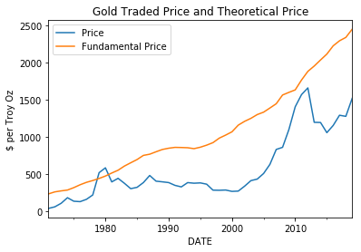
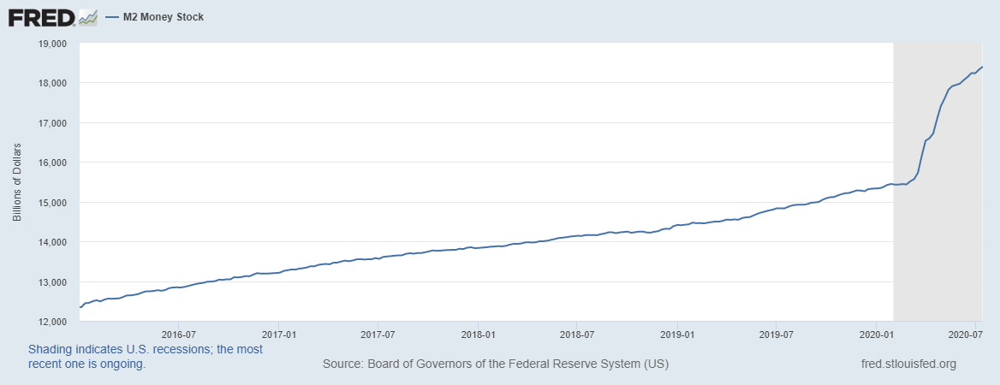
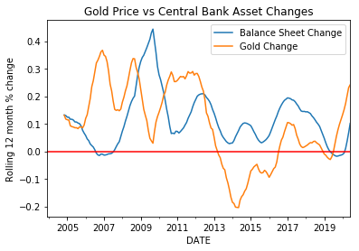
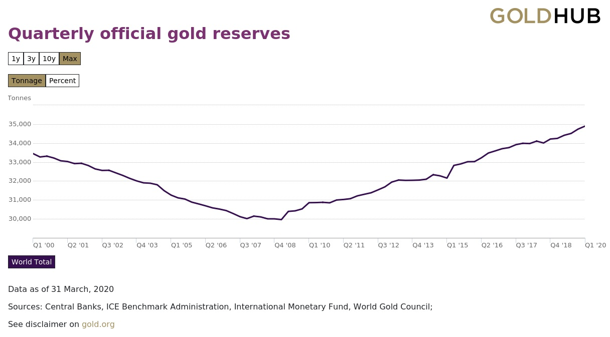

Title: An Analysis into Gold 
Slug: metals-1
Date: 2020-07-22
Tags: investing, $GLD, metals
Summary: There is a generational opportunity forming in gold and other related. We take a deep dive into the fundamental drivers of gold price.

<h3>Simple Gold Fair Value Model</h3>

A quick and dirty way to price gold is to look at the total amount of money in circulation (M2) and divide it by the size of gold stock. This would quite literally tell how much gold is worth.
It is kind of difficult to precisely measure all of the gold stocks in the world, but there are rough <a href="https://www.gold.org/about-gold/gold-supply/gold-mining/how-much-gold" target="_blank">estimates</a> we can use.
Splitting gold into jewellery, private investment, official holdings, and other, we see around 197.6k tonnes in existence at the end of 2019. In addition, we know that mining adds around 2.5-3k tonnes annually. 
Given that we are midway through 2020, I will add 1.5 tonnes and assume that we have a total of 199.1k tonnes of gold in existence. Turning this into troy ounces, we get around 6.4 billion troy ounces of gold. 
As of July 16th 2020, <a href="https://fred.stlouisfed.org/series/M2" target="_blank">M2</a> money stock was 18.522 trillion giving gold a fair value price of 2894 per troy ounce and at the current gold price of around 1870 there is roughly a 35% premium.

Unfortunately, I cannot get a time series of global gold stock to see compare the price of gold versus this fundamental calculation. 
However, I will try to estimate this number since the removal of the Bretton Woods agreement where we were taken off the gold standard by looking at the amount of gold produced annually[ref]
The gold production data was collected from the United States Geological Survey, which has annual <a href="https://www.usgs.gov/centers/nmic/gold-statistics-and-information" target="_blank">statistics</a> on a variety of minerals.[/ref] 
and subtracting it from the 197.6k tonnes at the end of 2019.
Using the same formula as above, I calculate the theoretical price of Gold and plot it against the traded price. We can see that gold typically trades at a large discount, but there are periods that it catches up or even surpasses the fundamental price. 

So why am I so bullish on gold right now? Below is a plot of M2 for the past 5 years. The line grew very steadily with a constant slope until March 2020, when the Fed relaxed lending rules (
<a href="https://www.federalreserve.gov/newsevents/pressreleases/bcreg20200323a.htm" target="_blank">I</a>, 
<a href="https://www.federalreserve.gov/newsevents/pressreleases/bcreg20200327a.htm" target="_blank">II</a>, 
<a href="https://www.federalreserve.gov/newsevents/pressreleases/bcreg20200401a.htm" target="_blank">III</a>, and
<a href="https://www.federalreserve.gov/newsevents/pressreleases/monetary20200423a.htm" target="_blank">IV</a>) and 
M2 took off like a rocket. Now gold is knocking at all time highs (in dollar terms) and I do not see the Fed reversing their policies anytime soon. The tailwinds are in-place for another gold run. A side note is that other central banks like the ECB are also engaging in similar techniques increasing the global money supply.
Further more the stimulus checks that the government hands out are were delivered via direct deposit into the checking account for around 90 million Americans. The same will be true for the purposed second round of stimulus checks and both of these stimulus checks are direct increases of money in circulation. 

<h3>Other Factors on Gold Price</h3>

The above model is a pretty rough estimate which only looks at two factors, money in circulation and gold stock. Some of the other main drivers are below and I will examine a few of these in detail.
<ol>
  <li>Gold price moves inversely to real interest rates.</li>
  <li>Gold is correlated to central bank balance sheet expansion.</li>
  <li>Like any other asset gold price is related to demand and supply.</li>
  <li>Gold is a safe haven asset and will rise in periods of global uncertainty.</li>
  <li>Gold is correlated to other commodities and will rise and fall in tandem.</li>
</ol>

<h3>Interest Rate</h3>

<!--- https://aheadoftheherd.com/Newsletter/2020/Negative-real-rates-puts-shine-on-Getchells-gold.htm -->
One of the strongest predictive and contemporaneous metrics to gold price is real interest rates. When real rates (interest rate minus inflation) are low or negative, the real return of bonds are unattractive as an asset class and people look for alternatives. 
<a href="https://www.gold.org/goldhub/data/global-gold-backed-etf-holdings-and-flows" target="_blank">Claude Erb and Campbell Harvey</a> look at the relationship between real interest rates and gold price and see a -.82 correlation between the two.  
We can use the 10-year TIPs (Treasure Inflation-Index Securities) to proxy the real interest rates and see how the relationship has performed in the past few years.
From 2003 to present day there is a -.88 correlation and below is a plot of the real rates and gold price.  
We see that other than a few liquidity events which impacted the price of gold but not real rates, there is a clear relationship inverse relationship between the two. Another way to visualize the strength of this relationship is to just multiply the real rates by -1, and look at the graph of inverse real rates to gold price (also plotted below).

Even before COVID-19 we had negative real rates and COVID-19 just accelerated the decline to levels not seen in a few decades. Until there is a cure for COVID-19, I do not see how this trend is going to be reversed and even with a cure, some economists are projecting years until we get back to pre-corona virus levels of economic activity.

 

<h3>Central Bank Balance Sheet</h3>

Aggregating some of the largest central banks in the world (Fed, ECB, BoJ)
[ref] PBoC is the other large central bank, but I was unable to find up to date data on its holdings.[/ref]
, I created a total balance sheet of these central banks. Then I take rolling 12 month differences between this aggregated global bank balance sheet and the price of gold.
I am able to see that gold typically appreciates in value when the Central Banks expand their balance sheet.
The major exception to this case would be in 2008, when gold tanked, but that was more due to a liquidity crisis where people were selling anything to get cash. 
In 2020, the Fed is taking unprecedented action to inject liquidity into the market by buying corporate bond ETFs. 
While I expect the expansion of the balance sheet to slow down, there is no indication that the Fed is planning to shrink the balance sheet anytime soon and this indicator is bullish.

<h3>Central Bank Gold Reserves</h3>

One of the main drivers of gold demand is central banks. We can see that central banks have been net buyers of gold. There are around 2500 to 3000 tonnes of gold mined annually and central banks are buying around 15-20% of the new gold and adding it to their reserves.
Below we can see that cumulative central bank reserves have been increasing by around 1000 tonnes every 2-3 years or the past 12 years. This trend should continue into the foreseeable future and some central banks (Russia and China) have even talked about increasing reserve purchase amounts.

<h3>ETF Flows</h3>

A good proxy for gold supply and demand are the ETFs as they are a lot more liquid and accessible for the everyday investor. A lot of these ETFs charge high expense ratios, because they store the physical gold.
From <a href="https://www.gold.org/goldhub/data/global-gold-backed-etf-holdings-and-flows" target="_blank">gold.org</a>, we can see the historical ETF flows around the world from 2003 till current day. 
I want to note the strong correlation between gold price on the right hand side and ETF flows. Positive ETF flows typically create positive gold prices and vice versa.
Looking at this chart, only one year has there been positive ETF flows and a drop in gold price. The second point I would like to note is the historic amount of ETF inflows 2020 has seen.
We are only halfway done the year, and already there is more than 500 tonnes of gold ETF inflows, the most in any year so far. I fully expect more gold inflows and there is a lot of price reflexivity here. 
As gold price increases, more people get bullish on gold and this creates an feedback loop. It has been 9 years, but gold is finally nearing all time highs in dollar terms.

<h3>Conculsion</h3>

Many of the historical gold indicators are flashing buy signs at the same time. I believe that gold is posied for a continued breakout past its all time highs. 
In the next few posts, I will talk about other some other assets that will rise in tandem with gold and some other investment possibilities.

