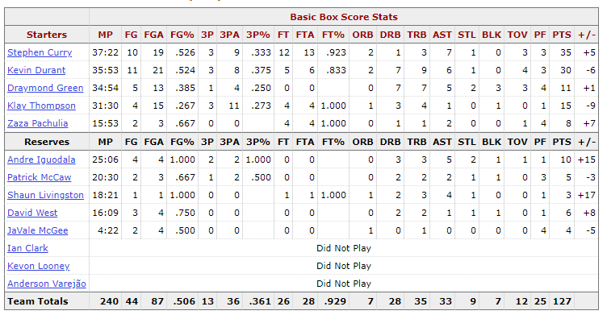
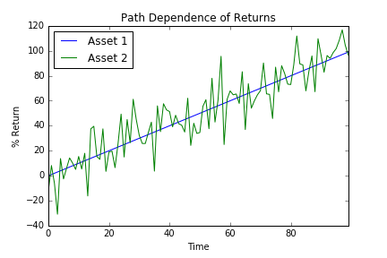

Title: Counting Stats
Slug: counting-stats
Date: 2020-07-22
Tags: NBA, analytics
Summary: The issue with counting stats and why the process of achieving a particular statistic is important.

Counting stats, otherwise known as basic stats, have long dominated basketball discussion, because they are easy to understand and the data is easy to collect. 
Anyone can look at a boxscore and analyze which players had good games or bad games; the issue is that these counting stats mask the process of the ball. They only show the end result and not the process (Embiid shout-out) of how the result was created.

Take an example from finance -- below are two theoretical equity returns of two assets which show the percent return from time t=0 to time t=100. Both of these assets return 100% in 100 periods, but they have very different paths to the 100% return.
Path 1 is very straight and linear, returning 1% every day for 100 days, while path 2 has a lot more volatility and drawdowns. To an investor who does not care about the paths that the assets take and only the end result/return, the assets serve the same purpose: they return the same net amount.
This type of investor is only interested in the asset price at t=0 when he buys it and the asset price at t=100, when he sells it and cashes out. All the information this investor needs can be captured with the two data points t=0 and t=100. 
This type of investor is similar to a person analyzing the box score, because the boxscore only contains the end result, not what happened in between to achieve that result. However, if a person was to go more granular into the asset returns and look at the day by day paths he would see that the two assets are not the same.
I bring this finance example into discussion, because not all counting stats are the same and equal, but they are often discussed as such.

By looking at the boxscore, one is able to see certain offensive categories like points, threes, rebounds, assists and defensive categories like blocks and steals.
Below is the Warriors boxscore from the Raptors-Warriors game on 2016-11-16. In this boxscore, we can see that Klay Thompson took 11 threes and made 3 while his backcourt mate Steph Curry took 9 and made 3.

<!---   -->

Suppose that Klay Thompson also took 9 threes and still made 3 of them for the same shooting percentage as Steph Curry. Then it would take a small jump of logic to say that Klay and Steph both shot 33% and had similar shooting nights.
This small jump of logic is similar to the fallacy in the two financial assets, because Steph Curry and Klay Thompson create their threes in very different ways: Klay Thompson is a lot more screen dependent then Steph Curry is. 

<!---   -->

When Klay Thompson gets open and shoots a three, often times there are many screeners setting multiple screens to free him up. If Zaza Pachulia sets Klay Thompson a perfect screen that frees him up for a wide open shot and Klay Thompson hits the shot, Thompson gets all the credit in the boxscore. The boxscore will increase Thomspon's FGA by 1 and his FGM by 1.
Zaza Pachulia gets no credit. But when Zaza Pachulia gets called for an illegal screen by attempting to free Klay Thompson up, Pachulia gets a TO credited to his box score, while Thompson gets nothing. So Thompson is getting all of the benefits of a Pachulia screen with none of the disadvantages in the boxscore, because the boxscore only focuses on the final result of a make or a miss and not the process.
An accurate statistic should incorporate the fact that Pachulia also helped in creating the shot for Klay Thompson and award him appropriately when Thompson hits a shot, while punishing Thompson when Pachulia sets an illegal screen.
More specifically, tracking data can calculate how close the nearest defender is to Klay Thompson when he shoots and give/take credit from Zaza based on this distance.

I bring up Thompsons's backcourt mate Steph Curry, because he shoots many of his three pointers off the bounce which do not require a screener. And because he creates more of his shots from a 1-on-1 perspective, his style is very different than Klay's, like how the two assets have different paths but all lead to the same net outcome. 
Curry's 1-on-1 playing style (although he does have off ball screens and pick and rolls) creates a more accurate representation of his 3-point shooting percentage when looking at the counting stats of 3PA and 3PM, because the screener is not being accounted for. Klay Thompson shooting around 42% (a very elite number) from three during his entire career, however the counting stats have inflated his number.
Suppose that Zaza Pachulia (and previously Andrew Bogut) sets an illegal screen that gets called 10% of the time resulting in a turnover. Instead of hitting 42 threes in 100 possessions, Thompson would instead hit around 38 threes in 95 attempts (but 100 possessions) giving him a real shooting percentage of 38%. 
This are all made up numbers and a moving screen should not be 100% the shooters or the screeners fault, but this example is just an illustration of how counting stats, while they give a good summary, are not entirely accurate in the picture they paint. 

Summary: Counting stats paint a slightly different picture than what goes on in a game. Only looking at counting stats neglects the process of the game, just like in finance how only looking at the end result removes intermediary fluctuations. Counting stats create a snapshot in time and summarize an entire possession of time in that snapshot.
If Klay Thompson spends 20 seconds running around 2 picks and an elevator screen to get opened, there are multiple people contributing to the final result, however all that gets recorded is what Klay Thompson does. Similarly, a rebound records the player coming down with the ball, but what about his teammates boxing out the opposing players? Shouldn't they get a little credit too?

