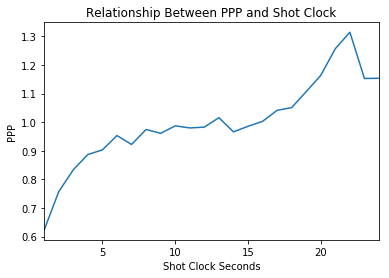
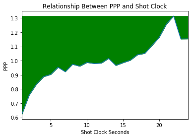
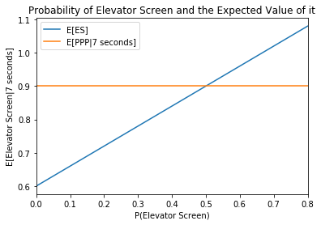
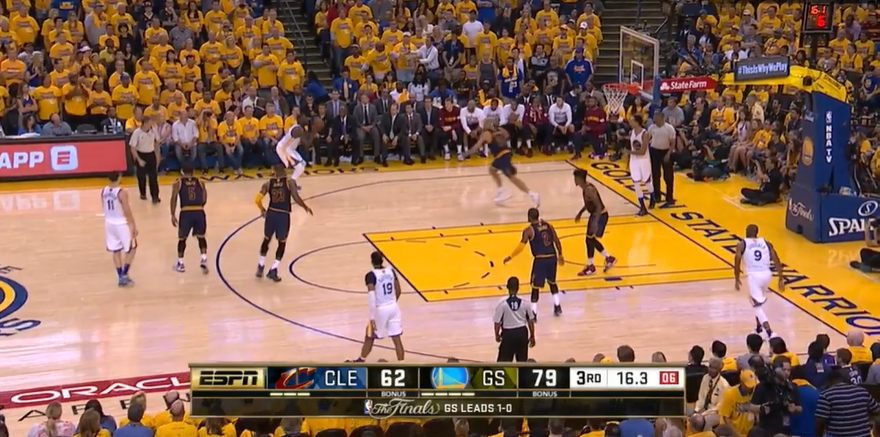

Title: Quantifying the Expected Value of a Second
Slug: shot-clock
Date: 2020-07-29
Tags: NBA, analytics
Summary: How valuable is each second on the shot clock? Should all seconds be valued the same?

<h3>Introduction</h3>

Basketball analytics have come a long way in recent years. A lot of work has gone into "efficient basketball" (dubbed Morey-ball by some) on how to optimize shot distribution.
This has led to teams sacrificing the midrange shots for a layup or a three-pointer.
In this post, I wish to do a deep dive into a lesser explored topic: the shot clock and how it can be used as a decision making tool to play optimal basketball.
For instance, a semi-contested three with 20 seconds left on the clock is probably not an ideal shot, but what if there is only 5 seconds left on the clock?
Is there a way quantify shot quality as it relates to the shot clock?

<h3>Background Knowledge</h3>
<h5>Shot Clock</h5>

In the 1954-1955 NBA season, the NBA introduced the 24-second shot clock to speed the game up.
The shot clock resets when there is a clear change of possession by either a defensive rebound, a turnover, or a made basket.
If there is a kick ball violation, foul, or offensive rebound[ref]Offensive rebounds use to reset to the entire 24 second shot clock, but this was changed for the 2019-20 season.[/ref], the shot clock resets to 14 seconds.
Teams have at most 8 seconds to get the ball across the half court line, so there is always at least 16 seconds in the 'half-court' setup.

<h5>Points Per Possession</h5>

Every offensive possession has a non-negative expected value, ranging from 0 to 3[ref]Technically, there is the ability to get a 4 point play with a three pointer plus a foul or even 5 points with a flagrant foul and a three pointer.[/ref].
A team can miss or turn the ball over in which case they score 0 points this possession, or hit a three-pointer in which case they score 3 points.
Teams will have different expected points per possession (PPP), and certain players are more efficient scorers than others, but in large part the PPP of a team ranges from about 1-1.15. Since teams typically have around 100 possessions per game, a .1 difference in PPP is very large and over the course of the game ends up being 10 points, the difference between a lottery team and a championship contender.

<h3>Thesis</h3>

Assume the Lakers are expected to score 1.2 points every possession and we denote this expression as $E[PPP|\text{24 seconds}]=1.2$. It is important to understand that this 1.2 number is with a full 24 second shot clock and should fall as the shot clock declines.
Taking the extreme, if there was only 1 second left on the shot clock, the $E[PPP|\text{1 second}]$ would be strictly less than 1.2 (probably more like .5) [ref]This is inherently due to the quality of the shot when the shot clock winding down being worse.[/ref]. 
I wish to quantify the difference in $E[PPP]$ as it relates to the shot clock, so every second on the 24 second shot clock will have a different $E[PPP]$.

My working hypothesis is that there is some sort of logarithmic distribution from 0-24 seconds. The $E[PPP]$ will be low in the beginning and then gradually rise and top off at 24 seconds.
Below, I have created a model of what I believe the trade-off should look like[ref] These values are rounded up, just like on the NBA shot clock so even if there is .1 seconds left on the shot clock it is counted as 1 second left.[/ref].
With 1 second left on the shot clock, anything thrown to the rim is better than an alternative of a turnover so I think $E[PPP|\text{1 second}]$ is close to the expected value of a contested fade-away.
At 24 seconds on the shot clock, we have the full 1.2 number, but the relationship should not be a linear one. NBA teams typically do not need the full 24 seconds to shoot and can probably generate a decent shot with half the time. 
More time just gives them the optionality to turn down good shots for great shots. I use an inverse exponential model which tails off later in the shot clock. 

<h3>Data</h3>

I was unable to get recent up to date NBA shot clock data as it seems the NBA back-end does not show shot clock data, but it still has a bunch of other (harder to collect) stats like closest defender distance and location on court.
If anyone knows how to collect this data please get in touch, I would love to use up-to-date data[ref] An alternative would be to parse the play-by-play data, and code up logic to calculate the shot clock, but I am trying to avoid that path for now.[/ref]. 
However, I found historical shot-log data[ref]It is worth noting that the data unfortunately only includes field goals and not free throws or turnovers.[/ref] which included shot clock for the <a href="https://www.kaggle.com/dansbecker/nba-shot-logs" target="_blank">2014-15</a> season.
This data includes over 100,000 shots with at least 1000 data points for each second of the shot clock so it is decently robust.
Although NBA teams have gotten more efficient over the past few years, I believe the overall relationship between PPP and shot clock should remain stable.

After doing some data cleaning like removing end of quarter situations when the shot clock is turned off to avoid rushed heaves, I group the data by second and look at the $E[PPP]$ at each of these seconds to create the plot below. I shall refer to this plot as the PPP trade-off curve.
We see a similar shape to my predicted curve, where at 1 second, the PPP is below .6 and at 24 seconds the PPP is around 1.2. An interesting observation is that the PPP peaks at around 22 seconds as opposed to 24 seconds, and I suspect this has to do with offensive rebounds and immediate put backs.
The shots with 23 and 24 seconds left on the shot clock are offensive rebounds and thus contested close to the basket shots, whereas the shots with 21 and 22 seconds left on the shot clock could be great transition looks as it takes a few seconds to get down the court[ref]I believe that using the new 2019-2020 season data which resets shot clock to 14 after offensive rebounds will change this shape dramatically with regards to the 23 and 24 seconds shots.[/ref].
Also, it is interesting that there is a slight increase in efficiency around 12 and 13 seconds left on shot clock as opposed to 14 and 15, which could be due to the fact that shot clocks reset to 14 seconds after fouls.
This then enables a team to run a scripted out of bounds play which could lead to a cleaner look and more efficient shot.

<h3>Game Adjustments</h3>

I want to clarify that these numbers are in the context of generating good looks. Just because people score around 1.1 PPP when there is 24 seconds left on the shot clock does not mean launching full court shots is a winning basketball strategy.
There are a lot of extensions that can be built upon this analysis, but it hints that NBA teams should always be pushing the pace to give them more opportunities to generate a clean look.
Often times we see point guards just casually bring the ball up the court, but they should probably be sprinting as every second is valuable.
From a more mathematical perspective the PPP trade-off curve can dictate optimal basketball strategy, like when to swap a good shot for a great shot, which play to run, and even which players should be on the court.

<h5>When to shoot?</h5>

In an optimal world, teams are able to calculate the expected value of any shot using a few important features such as:
<ol>
  <li>Who is shooting the ball?</li>
  <li>Who is the closest defender?</li>
  <li>What is the distance of the closest defender?</li>
  <li>What is the shot location?</li>
  <li>How much time is left on the shot clock?</li>
</ol>

This information can then be extrapolated and used as a decision making tool.
If the player believes that his current shot is highest expected value his team is going to get this possession then he should shoot it; else he should turn the shot down.
This is a very hard decision, because players do not know the expected value in the future; at best the player holding the ball can pass to a teammate and calculate his teammate's expected value of a shot using the same criteria above.
Besides the one pass ahead calculation (which will have a lot of variance), most of the time a player just would not know the future value of this possession, so it brings a game theory question of what to do with the ball.

A player can rely on the PPP trade-off curve to aid in his decision making process. 
On a broad level, if a shot creates more expected value than the $E[PPP]$ at the given shot clock time, a player should probably shoot the ball.
This provides his team with higher than average PPP which by definition is a winning strategy in the long run[ref]Teams can customize the PPP trade-off curve to add in their own percentages as they may be more or less efficient than league average[/ref].
Using the same graph as above, I shaded the green area to represent optimal area to shoot and shall refer to this area as the green zone.
Most of the time the optimal strategy is to take the first shot that is in the green area, as the expected value of the possession decreases the longer a team holds the ball.
I say most, because as mentioned previously there are occasions where the extra pass leads to an increase in $E[PPP]$ and players need to weigh this trade off carefully.

<h5>Coaches Play Calling</h5>

Coaches can also follow the trade-off curve when calling plays. 
The Warriors are actually a prime example of a team successfully implementing the PPP trade-off curve, even though they never formalized this concept. 
For the majority of the shot clock, the Warriors will run a variety of screens to free up Curry or Thompson to get them a comfortable shot.
If the plays are successful in creating a clean look, the shot would instantly be in the green zone (regardless of shot clock) as both are prolific 40%+ shooters from deep.
A classic example is this <a href="https://gfycat.com/brightweirdcranefly" target="_blank">elevator screen</a> where three other Warriors players work in unison to get Curry an open look.

Lets take a closer look at the elevator screen referenced above. Notice the shot clock is at 7 seconds during the initial pin-down and then Curry catches it with about 4 seconds left.
A wide open Curry three is worth at least 1.2 points, but what if the Jazz switched and blew this play up? Then Klay would be isoed against Gordon Hayward 30 feet from the hoop with 3 seconds left on the shot clock, and I estimate this to probably be around .6 points.
Using the PPP trade-off curve as a guideline, one can judge if the elevator screen was a good play call with 7 seconds left on the shot clock. 
Let us assume that the elevator screen play takes 4 seconds to run. We can then formalize the question: 
if the expected value of the elevator screen play plus the expected value of the 3 seconds after that are greater than the $E[PPP|\text{7 seconds}]$, the elevator screen is a good play to call.

Let us break the outcome of the elevator screen play down into two states, the state that Curry gets a clean look and the state that Curry does not so Thompson keeps the ball.
This would lead us to a formula to calculate $E[\text{Elevator Screen}|7 seconds]$.

\begin{align}
E[\text{Elevator Screen}|7 seconds] &= P(ES)* E[\text{Curry 3PA}] + (1-P(ES))* E[\text{Iso}|\text{3 Seconds}] \\
\text{where} & \\
E[\text{Elevator Screen}|7 seconds] &= \text{Expected Value of the Elevator Screen given 7 seconds left} \\
P(ES) &= \text{Probability elevator screen is run successfully} \\
E[\text{Curry 3PA}] &= \text{Expected value of Curry getting a relatively clean look from three} \\
E[\text{Iso}|\text{3 Seconds}] &= \text{Expected value of Klay isoing given 3 seconds left} \\
\end{align}

If $E[\text{Elevator Screen}|7 seconds]=E[PPP|\text{7 seconds}]$, then the play was an average play, and the delta between these variables will determine how good or bad of a play it is.
Maintaining the prior assumptions that a Curry three is worth 1.2 points, a Klay iso (with 3 seconds left) is worth .6 points, and $E[PPP|\text{7 seconds}]$ is .9 points, I will vary $P(ES)$ values to determine the possible range of $E[\text{Elevator Screen}|7 seconds]$.
Looking at the graph below, I plot two lines $E[\text{Elevator Screen}|7 seconds]$ and $E[PPP|\text{7 seconds}]$ to see at which point the trade off occurs.
So to answer the original question, if the Warriors can get the $P(ES)$ above .5, then the play is good, as they will be in the green zone.
If they cannot then they should run a different play with 7 seconds left.

<h5>Decision Making Detailed</h5>

The above example is a scenario in which the primary option was open, but it is not always that simple. Sometimes the defense rotates to recover and it is during these instances the PPP trade-off curve can be used effectively.
<a href="https://streamable.com/ecwb" target="_blank">Here</a> we have a couple of screens that do not lead anywhere until a Thompson Green pick and roll with 10 seconds left in the shot clock.
Draymond Green catches the ball wide open with six seconds left on the shot clock and the picture below captures this exact moment. 
Green ends up turning that shot down to pass to Livingston under the hoop and I argue that this was a suboptimal decision with respect to the PPP trade-off curve.

If he shoots the ball there, it roughly translates to 1.16 points given that he was shooting 38.8% from three that year and he is wide open. 
This 1.1 number is much higher than the typical points expected with 6 seconds left in the shot clock, so he probably should have shot it. 
The counter argument is if he thinks Livingston under the hoop versus Iman Shumpert is a higher expected value than 1.16 points which would mean Livingston would have to shoot above 58% on his shot, which I do not think is likely.

Just pulling up Livingston's shooting splits and his proximity to the hoop which I estimate at around 5 feet[ref]The entire paint is 12 feet wide, half of that would be six feet and he looks to be slightly inside the paint[/ref], I see that he shot around 45% from that distance, giving an expected value of 0.9 points on that shot.
This play by Draymond ends up turning into a positive because Lebron inexplicably doubles, leaving JR Smith to fend off Thompson and Barbosa. 
JR Smith then compounds Lebron's mistake by leaving Klay Thompson one of the greatest shooters in NBA history open to contest Barbosa, a career average 3-point shooter. 

<h5>Tough Shots</h5>

Finally, certain players are better at scoring tough shots than others. This skill is not very useful when there is 20 seconds left on the shot clock, but is very useful when there is 5 seconds off the shot clock.
Many times plays do not work, counters to plays do not work, and the last resort is to throw it to a player and let him create something out of nothing. 
Going back to the Warriors, Kevin Durant was notorious for the bailout call, where he would get the ball with less than five seconds left and shoot a contested jump shot efficiently.
His ability to hit difficult shots at an elite clip complimented the Curry and Thompson screens and this is why the Warriors had one of the best offensives in the history of the NBA.

<h3>Final Thoughts</h3>

<ul>
  <li>
  Current boxscore basic and advanced stats come up short in evaluating tough shots, because they group the shots together without looking at circumstances such as shot clock.
Shooting 45% on tough shots is not efficient when there is plenty on time on the clock, but it is elite if there is only a few seconds left. There should be some metric that quantifies the ability to score while the shot clock is low.
  </li>
  <li>
  If a player holds the ball for a long time or drives to the hoop without creating any shot, he is actually harming the expected points of the possession.
  However, this player receives no direct negative statistic in the boxscore. 
  Another variation of this is when teams spend a majority of the shot clock to post up a player and the pass never gets thrown, either due to poor positioning by the guy in the post or the person throwing the ball.
  One of these players should be penalized for the seconds wasted but this does not exist in current stats.  
  </li>
  <li>
  The exact counter point is when the defender shuts down a drive. This defender does not receive any accolades for chopping seconds off the shot clock as the play must now reset.
  </li>
  <li>
  Teams can go through a game and rate every possession to see when a shot was taken in the green zone and when a shot was passed up in the green zone. 
  They can then attribute these plays to individual players, to see which players make good decisions and vice versa.
  </li>
</ul>

