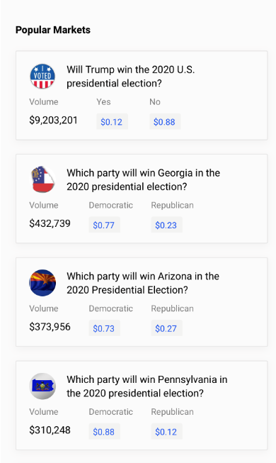

Title: Election Odds
Slug: prediction-markets
Date: 2020-11-08
Tags: Election, 
Summary: Political betting markets are often mispriced in both a relative value and an absolute value manner

<h3>Introduction</h3>

There are numerous prediction markets[ref]Sports betting is a subsection of prediction markets.[/ref] which are implemented to trade the outcome of events like if Donald Trump will win the 2020 presidential election.
These markets are different from traditional financial markets because they usually have a defined end point where the bet settles to either 0 or 1 (similar to sports betting).
Due to the nature of the settlement, there is extreme volatility as new information gets processed and odds rapidly shift. 
Currently, the most popular prediction markets are the political events like the recent 2020 presidential election; in fact this election has generated the most volume of any event in the <a href="https://twitter.com/DaveMasonBOL/status/1324432207549792258" target="_blank">history</a> of many bookies.
Other less popular markets include world events like "if Kim Jung Un will still be North Korea's leader by the end of this year" and if "2020 will be the hottest year on record".
They can range from "if Kim Kardashian and Kayne West will get a divorce in 2020" or "if Airbnb will begin publicly trading in 2020". 

The most popular prediction betting sites[ref]Other than the sports betting sites[/ref] are <a href="https://www.predictit.org" target="_blank">PredictIt</a> or the decentralized crypto alternatives <a href="net" target="_blank">Augur</a> and <a href="https://polymarket.com" target="_blank">Polymarket</a>. 
Oftentimes these sites will have similar markets, so sometimes arbitrage is possible between the sites or even within the various markets in the site.
When doing this it is important to read the fine print as to how the bet settles as they could slightly differ from site to site. 
In addition different sites have different betting and payout fees. 
<ul>
  <li>PredictIt has a 5% withdraw fee and a 10% winnings fee. </li>
  <li>Augur uses base layer Etherum and will have expensive gas fees along with around 1-2% of winning fees.</li>
  <li>Polymarket charges around 2% of trades because it uses an AMM (Automated Market Maker) similar to Uniswap and its bonding curve. [ref]I will dictate a future series of posts to AMM's as they have very interesting principles.[/ref]
</li>
</ul>

It is worth noting that PredictIt is capped at \$850 dollar max risk per bet in order to comply with regulations and users need to KYC. 
They try to get around this by offering multiple ways to bet the same outcome like "Will Donald Trump win the 2020 presidential election" along with "Will the republican nominee win the 2020 presidential election".
Augur and Polymarket do not suffer from these constraints as they are decentralized, but they have less volume and liquidity than PredictIt.

<h3>Election Primer</h3>

It is shocking how much volume and liquidity there is for these some of these events, because they are often mispriced relative to other correlated bets as well as in absolute probability.
Below is a screenshot of the Polymarket presidential market and the correlated markets taken November 6th 2020. 
Note that a yes of $0.12 means the yes outcome has a 12% chance of occurring.

Joe Biden, the democratic contender, is on the eve of winning the election and the only ballots left to count are the mail-in ballots and provisional ballots which heavily lean democrat.
At this point, most of the battle ground states (Florida, Michigan, Wisconsin) had been called[ref]Biden's margin of victory in Wisconsin was below the automatic threshold so there would be an automatic recount triggered by state law, but in the history of recounts those have not changed the final tally by over one thousand whereas his margin of victory in Wisconsin was over twenty thousand.[/ref],
or about to be called. 
For all intensive purposes, Joe Biden wins this election if he wins either Georgia, Arizona, or Pennsylvania whereas Trump would need all three states.

<h3>Election Modelling</h3>
<h5>Relative Probabilities</h5>

Instantly it is obvious that something is wrong with these odds. If we use relative probabilities implied from the state odds, then we can calculate Biden's chances as follows:

\begin{align}
P_{Biden} &= 1-((1-P_{ADem})*(1-P_{GDem})*(1-P_{PDem}))\\
P_{Biden} &= 1-(.27*.23*.12)\\
P_{Biden} &= 1-(.0075)\\
P_{Biden} &= .9925\\
\\
\text{where} & \\
P_{Biden} &= \text{Probability that Biden wins the election} \\
P_{ADem} &= \text{Probability that Biden wins Arizona} \\
P_{GDem} &= \text{Probability that Biden wins Georgia} \\
P_{PDem} &= \text{Probability that Biden wins Pennsylvania} \\
\end{align}

Assuming the probabilities of winning each state are independent, the probability that Biden wins the election is the reciprocal of the probability that he losses all the states.
Nonetheless, some simple hard arbitrage betting strategies can be created like buying Biden winning the presidential election and Trump winning Pennsylvania.
In this scenario, if Biden wins Pennsylvania, he automatically wins the presidential election and the market is hedged, we make \$.12 off Biden's presidential victory and lose \$.12 off Trump's Pennsylvania victory.
If Biden losses Pennsylvania, then we make \$.88 off Trump's Pennsylvania victory and can potentially still win the presidential election, but even if he loses the loss is still only \$.12 for a total profit of \$.74.

<h5>Absolute Probabilities</h5>

Pollsters often use advanced models to try and predict the probabilities of the election race. 
Some of the more popular/famous ones include Nate Silver, who famously predicted all of the races correctly in <a href="https://www.theguardian.com/world/2012/nov/07/nate-silver-election-forecasts-right" target="_blank">2012</a> and 49/50 correctly in <a href="https://www.theguardian.com/commentisfree/2008/nov/06/us-elections-nate-silver-predictions" target="_blank">2008</a>.
How these models build fundamental predictions from the bottom up is more advanced than the scope of this blog, but the gist is that they take state polls and try to adjust for various polling biases like education and race.
Here is a <a href="https://www.youtube.com/watch?v=D8dyuRYqkhk" target="_blank">video</a> of him calling the Pennsylvania race 1/20000 chance for Trump making both the Biden Presidency and Biden Pennsylvania lines very mispriced.
At this point, Biden was ahead of Trump with only mail-in and provisional ballots left and Nate Silver like most political analysts saw no chance for Biden to lose, but the market had Biden only at 88% to win the election.

<h3>Conclusion</h3>

There is a lot of edge in these prediction markets both from an absolute value perspective and from a relative value perspective.
These markets have started to generate a lot of interest and I expect volume and liquidity on these platforms to grow in the coming years.
I see modelling these markets as no different than sports betting because they both have defined payouts at fixed ending times.

